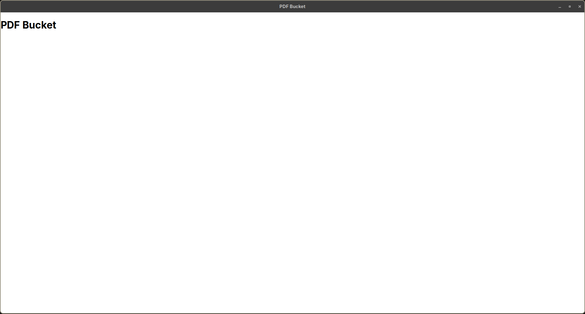
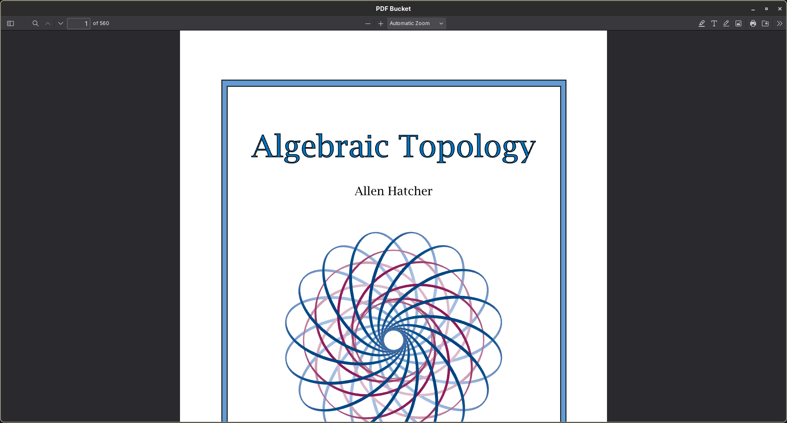
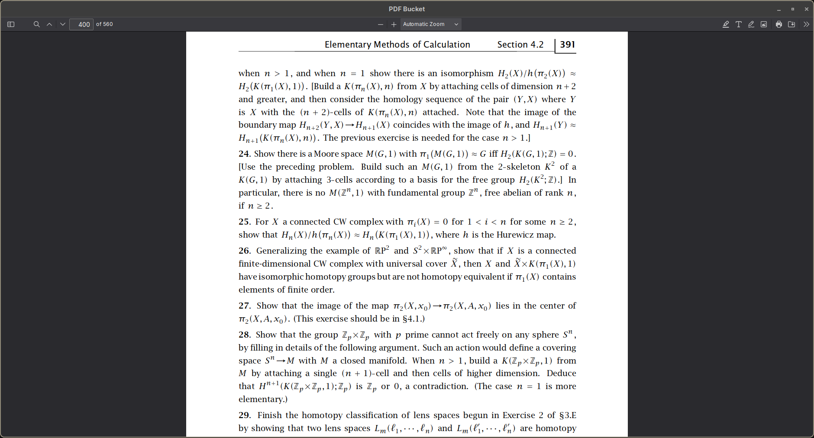
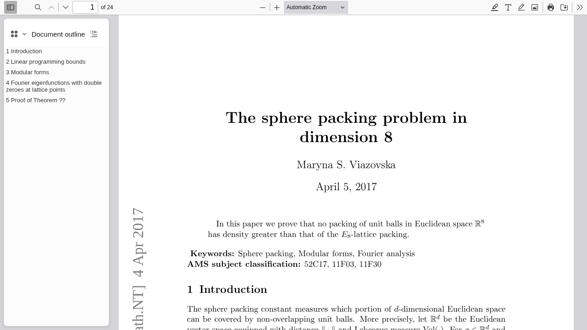

# M0 evidence: window, server, one PDF, one URL, connector save

Recorded on 2026-09-23 on the development workstation (Arch Linux, Hyprland, WebKitGTK
2.52.6, Chromium 153, Zotero with the local write API 3.4.0, Zotero Connector 5.0.215).

## Server status

```console
$ just serve
$ curl -s http://127.0.0.1:8770/status
{"backend_url":"http://127.0.0.1:8770","root":"/home/dzack/PDFBucket","service":{"name":"pdf-bucket","version":"0.1.0"},"storage":{"root_exists":true,"root_writable":true},"capabilities":{"capture":true},"ready":true}
```

## Capture with embedded provenance

```console
$ curl -fsSL -o viazovska.pdf https://arxiv.org/pdf/1603.04246
$ sha256sum viazovska.pdf
f9f3a16da44702bb812d8db28ef5cb53bd4904fc6815a9be9ea80b653e341ac7  viazovska.pdf
$ curl -s -F "pdf=@viazovska.pdf;filename=1603.04246.pdf;type=application/pdf" \
    -F pdf_url=https://arxiv.org/pdf/1603.04246 \
    -F source_url=https://arxiv.org/abs/1603.04246 \
    -F "title_hint=The sphere packing problem in dimension 8" \
    http://127.0.0.1:8770/capture-bytes
{
  "key": "1603.04246",
  "existing": false,
  "stored_sha256": "24ce4492d5bb1d1d9dc28c891332fd75c2d3cbacd4d76681adcb921b17fde9cf",
  "reader_url": "http://127.0.0.1:8770/read/1603.04246",
  "pdf_url": "http://127.0.0.1:8770/pdf/1603.04246.pdf",
  "provenance": {
    "pdf_url": "https://arxiv.org/pdf/1603.04246",
    "source_url": "https://arxiv.org/abs/1603.04246",
    "captured_at": "2026-09-23T11:44:19.278584Z",
    "original_sha256": "f9f3a16da44702bb812d8db28ef5cb53bd4904fc6815a9be9ea80b653e341ac7",
    "title_hint": "The sphere packing problem in dimension 8"
  }
}
```

The stored hash differs from the original hash because the provenance is written into the
file. `GET /read/1603.04246` carries:

```html
<meta name="citation_title" content="The sphere packing problem in dimension 8" />
<meta name="citation_pdf_url" content="http://127.0.0.1:8770/pdf/1603.04246.pdf" />
<meta name="citation_abstract_html_url" content="https://arxiv.org/abs/1603.04246" />
```

## Desktop window

`just run` builds the web bundle, starts the server through Tauri's `beforeDevCommand`,
and opens the window on the server root:



The stop condition asked whether the PDF.js viewer is usable inside WebKitGTK for a
300-page PDF. Hatcher's *Algebraic Topology* (560 pages, captured from
`https://pi.math.cornell.edu/~hatcher/AT/AT.pdf`) opened in the same window with the
modern PDF.js 6.3.289 build:

```console
$ cd desktop && bunx @tauri-apps/cli dev --config '{"build":{"devUrl":"http://127.0.0.1:8770/read/AT"}}'
```



Page 400, opened with the viewer's `#page=400` fragment, renders with its text and math
sharp:



Result: the viewer is usable in WebKitGTK; the Electron fallback is not needed.

## Zotero Connector saves the reader page

The Connector installed on this workstation is the Chromium one (the Firefox profile has no
Connector). `scripts/connector_save.py` loads that installed build, unmodified, into a
throwaway Chromium profile, opens the reader page, and runs the Connector's
save-with-translator action, which is what its toolbar button runs once a translator has
matched the page (here, Embedded Metadata):

```console
$ uv run scripts/connector_save.py http://127.0.0.1:8770/read/1603.04246 connector-save.png
{
  "item": {
    "key": "3WDMCG9D",
    "itemType": "journalArticle",
    "title": "The sphere packing problem in dimension 8",
    "url": "https://arxiv.org/abs/1603.04246",
    "accessDate": "2026-09-23T11:57:50Z",
    "dateAdded": "2026-09-23T11:57:50Z"
  },
  "attachments": [
    {
      "key": "SKHR3IHF",
      "title": "Full Text PDF",
      "url": "http://127.0.0.1:8770/pdf/1603.04246.pdf",
      "sha256": "24ce4492d5bb1d1d9dc28c891332fd75c2d3cbacd4d76681adcb921b17fde9cf"
    }
  ]
}
```

The item fields come from Zotero's local API
(`http://127.0.0.1:23119/api/users/0/items/3WDMCG9D`) and the attachment hash from the
file in `~/Zotero/storage/SKHR3IHF/`.

| Check | Expected | Observed |
| --- | --- | --- |
| Item `url` | source URL `https://arxiv.org/abs/1603.04246` | `https://arxiv.org/abs/1603.04246` |
| Attachment SHA-256 | stored PDF `24ce4492…fde9cf` | `24ce4492…fde9cf` |

The page the Connector saved:



After the readback the evidence item was moved to Zotero's trash (write API
`trash_item`), so the library holds no item that the user did not save.
