# M1 evidence: capture extension for Chrome and Firefox

Recorded on 2026-09-23 on the development workstation (Arch Linux, Hyprland 0.56, Chromium 153, Firefox 156, WebKitGTK 2.52.6).

## How capture works

- **Interception.** One WXT source tree (`src/extension`) builds both extensions.

  - Chrome registers the declarativeNetRequest rules in `src/extension/interception.ts` at service-worker start.
    They are the mozilla/pdf.js `pdfHandler.js` rules, restricted to GET and with an allow rule for the bucket origin.

  - Firefox has no response-header rule condition, so it evaluates the same decision (`isPdfResponse`) in a blocking `webRequest.onHeadersReceived` listener.

  - Both browsers redirect main-frame and sub-frame PDF responses to `capture.html?<PDF URL>`.

  - `<embed>` and `<object>` loads (resource type `object`) are not intercepted.

- **Link origin.** A content script reports every followed link (page URL, link text, page title) to the background.
  The capture uses this report for `source_url` and `title_hint`. With no report (a typed-in URL or a framed PDF), `source_url` is the PDF URL and the title is the filename.

- **Capture.** The capture page asks the background to capture the PDF. The background fetches the PDF with the browser's cookies and posts it to `/capture-bytes`. It uses the `Content-Disposition` filename, else the last URL segment, as the store key.
  The page shows exactly one of these states:

  - stored (new or already present), with the title, the reader URL and the original PDF URL;

  - failed, with the stage, the error and a link that opens the PDF natively.

- **Hand-back.** In a sub-frame smaller than `capture.min_frame_width` × `capture.min_frame_height` (`pdf-bucket.config.json`), the capture page registers a (tab, URL) exemption and reloads the PDF in the browser's viewer.
  The native-open link uses the same exemption: a Chrome session rule scoped by `tabIds`, or an in-memory set in Firefox.
  The exemption is cleared when the tab closes.

- **Window.** After every capture, new or existing, the server sends an `open-reader` event on `GET /api/events`. The Tauri main window has an initialization script (main frame only, bucket origin only) that subscribes to that stream, requests focus, and navigates to the reader URL. Reader pages opened in a browser tab do not have the listener.

- **Bucket origin.** The extension reads the bucket host and port from `pdf-bucket.config.json` at build time (`extensionDefine` in `wxt.config.ts`). The Tauri crate reads them at compile time.

## Browser end-to-end suite

```console
$ just test-capture
 18 pass
 0 fail
Ran 18 tests across 1 file. [32.28s]
```

`tests/capture-e2e.test.ts` builds both extensions against an in-process bucket on a free port and drives them with Puppeteer:

- Chromium: `enableExtensions`.

- Firefox: WebDriver BiDi `webExtension.install`, with `-remote-allow-system-access` so that BiDi can script the moz-extension capture page.

The fixture site (`tests/fixture-site.ts`) sets a per-run session cookie on every page, and every PDF route returns 403 without that cookie.
A capture that does not send the browser's cookies therefore fails.
The suite is part of `bun test`. The whole suite (26 tests) runs in about 38 s.

| Fixture case | Expected | Chromium | Firefox |
| --- | --- | --- | --- |
| arXiv `/pdf/2401.00001` (no `.pdf`, `application/pdf`) | intercepted | stored as `2401.00001.pdf` | stored as `2401.00001.pdf` |
| `/notes/lecture-notes.pdf` | intercepted | stored as `lecture-notes.pdf` | stored as `lecture-notes.pdf` |
| `/download?id=problem-set`, `application/octet-stream`, `Content-Disposition: attachment; filename="problem-set.pdf"` | intercepted | stored as `problem-set.pdf` | stored as `problem-set.pdf` |
| inline `<embed>` 320×240 | left alone | not captured | not captured |
| POST form returning `application/pdf` | left alone | not captured, no GET re-fetch | not captured, no GET re-fetch |
| `<iframe>` 1000×700 | intercepted | stored as `chapter.pdf` | stored as `chapter.pdf` |
| `<iframe>` 320×240 | left alone | handed back, frame shows the PDF | handed back, frame shows the PDF |
| bucket's own `/pdf/lecture-notes.pdf` | left alone | not captured | not captured |
| second visit to the lecture-notes link | existing item | same file, same hash | same file, same hash |
| bucket stopped | failure and native link | failure shown; link opens the PDF with one fetch | failure shown; link opens the PDF with one fetch |

For each intercepted case, the suite reads the stored file's embedded provenance through the store (`pdfbucket describe`). It checks `pdf_url`, the linking page as `source_url`, the link text as `title_hint`, and the SHA-256 of the served bytes.
The store directory holds exactly one file per intercepted URL.

## Capture page

Saved, and a second visit to the same URL (Chromium):

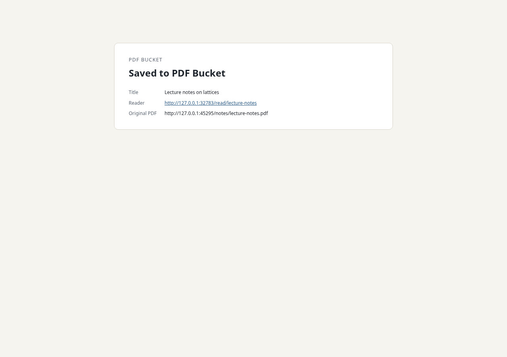 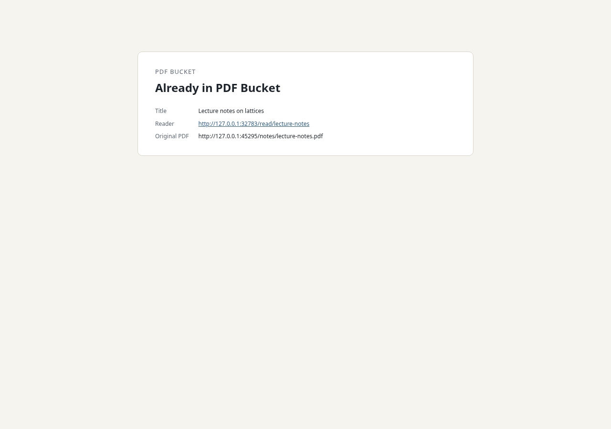

Bucket stopped, at desktop width and at 400 px (Chromium):

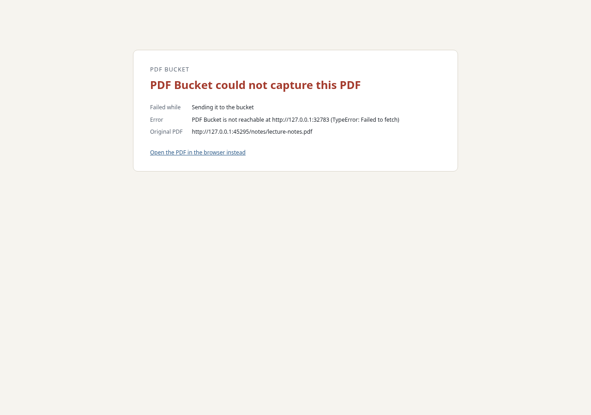 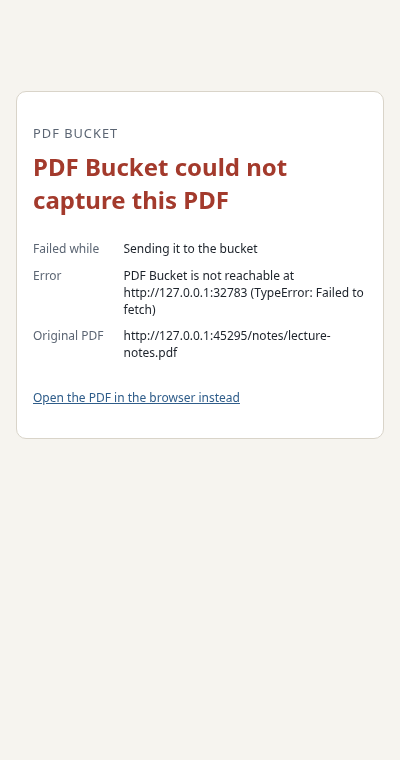

Firefox.
BiDi cannot screenshot moz-extension documents, so the capture page records its own tab with `tabs.captureVisibleTab`:

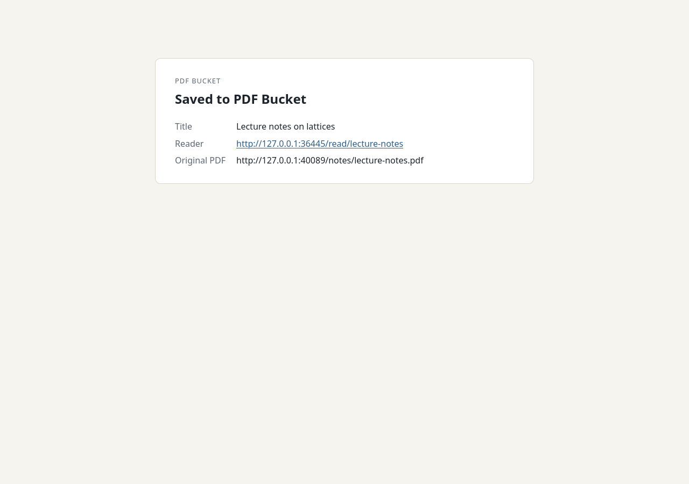 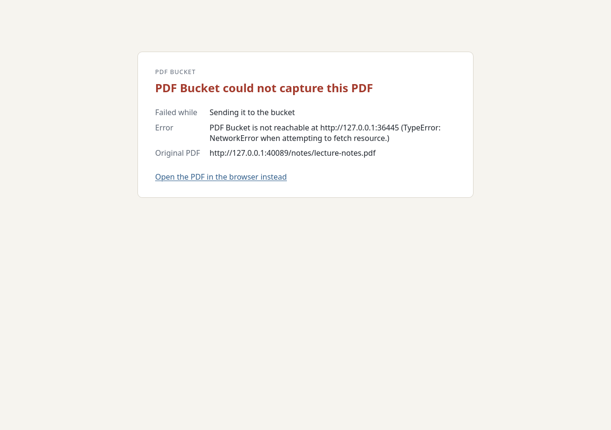

A large iframe captured in place, and the native-open link followed with the bucket stopped (Firefox):

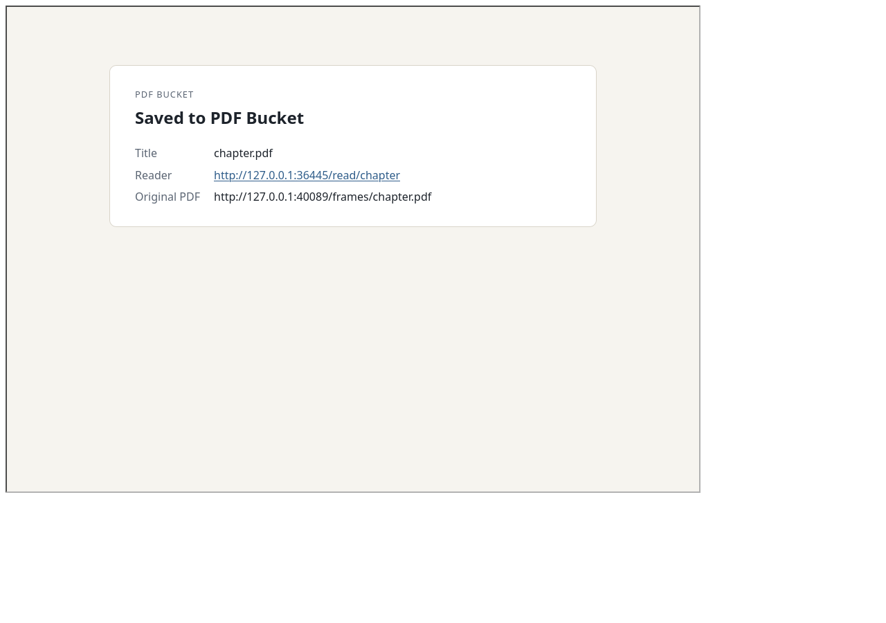 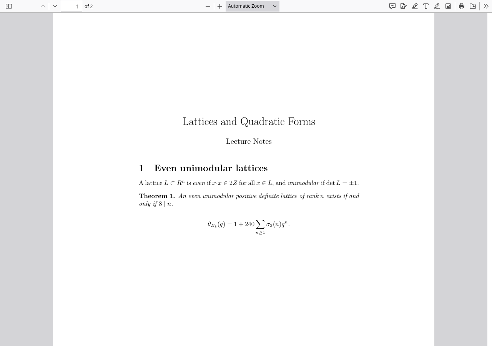

## Desktop window follows captures

The window was built from a copy of `desktop/` whose config names port 18770, with a bucket on 18770 over a temporary store.
The port-8770 bucket was not used.

```console
$ bunx @tauri-apps/cli dev --no-watch --config '{"build":{"devUrl":"http://127.0.0.1:18770","beforeDevCommand":""}}'
$ curl -s -F "pdf=@tests/fixtures/lecture-notes.pdf;filename=lecture-notes.pdf;type=application/pdf" \
    -F pdf_url=https://www.math.example.edu/~author/lecture-notes.pdf \
    -F source_url=https://www.math.example.edu/~author/teaching.html \
    -F "title_hint=Lecture notes on lattices" http://127.0.0.1:18770/capture-bytes
{"key":"lecture-notes","existing":false,"reader_url":"http://127.0.0.1:18770/read/lecture-notes"}
```

The window before the capture, on the server root:

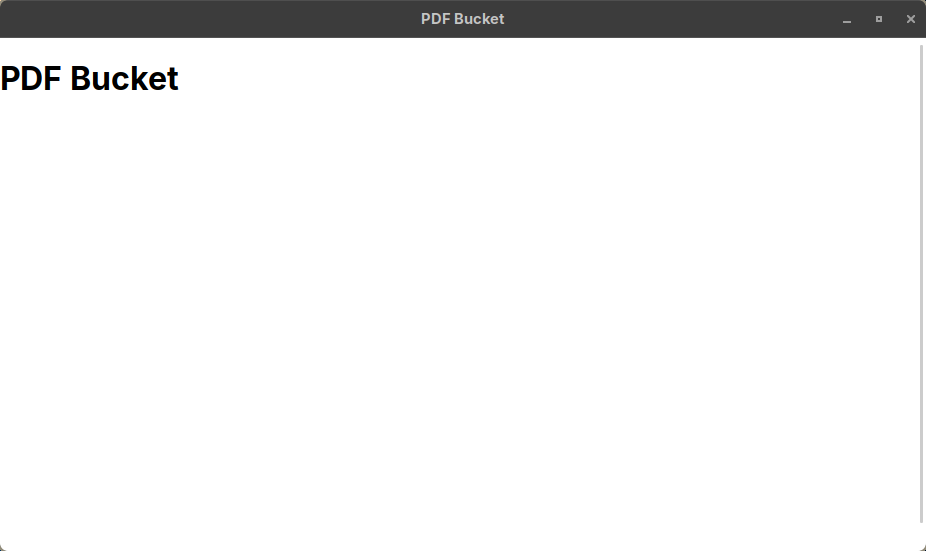

After the capture, on `/read/lecture-notes`:

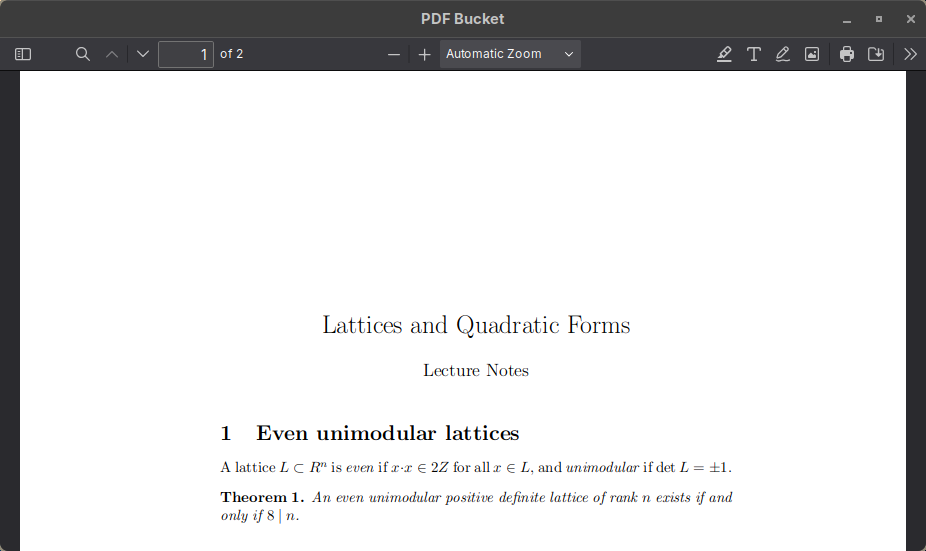

A second capture (`problem-set`) while the window showed the first reader page:

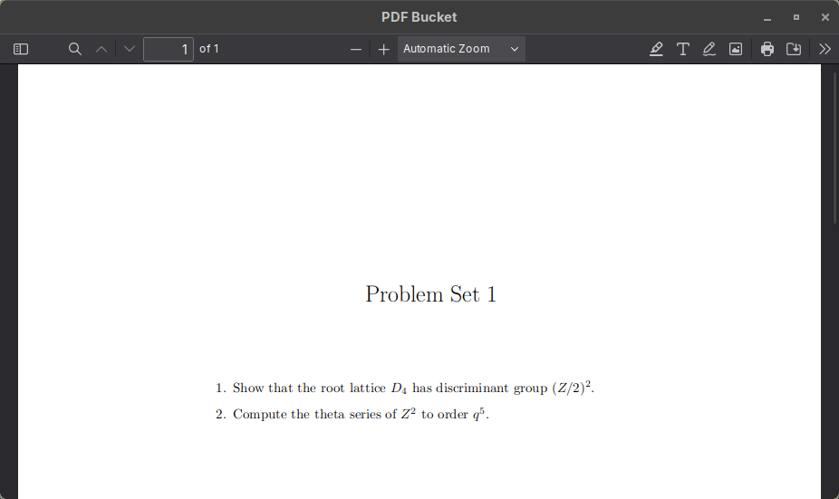

The focus request did not move keyboard focus under Hyprland, with `misc:focus_on_activate` false and also with it true.
Tauri's `set_focus` does nothing on the Wayland backend (tauri-apps/tauri#14913). The navigation is not affected.
