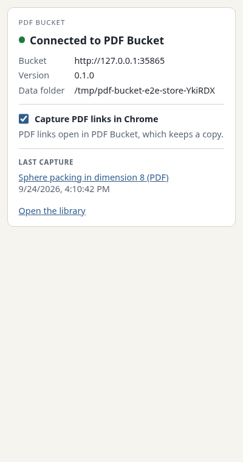
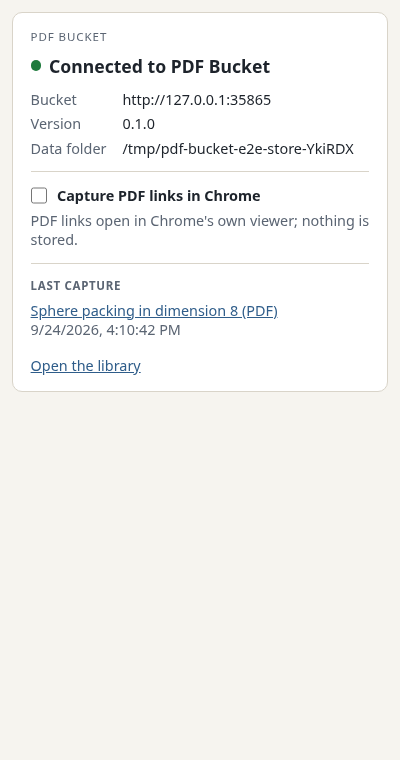
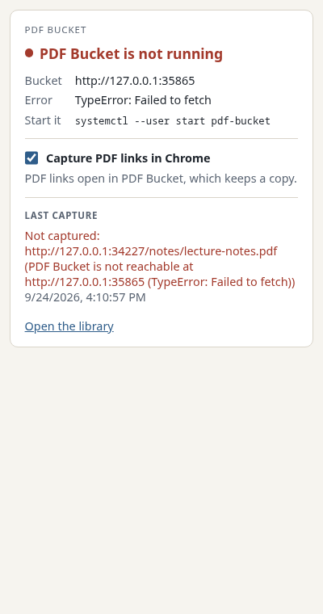
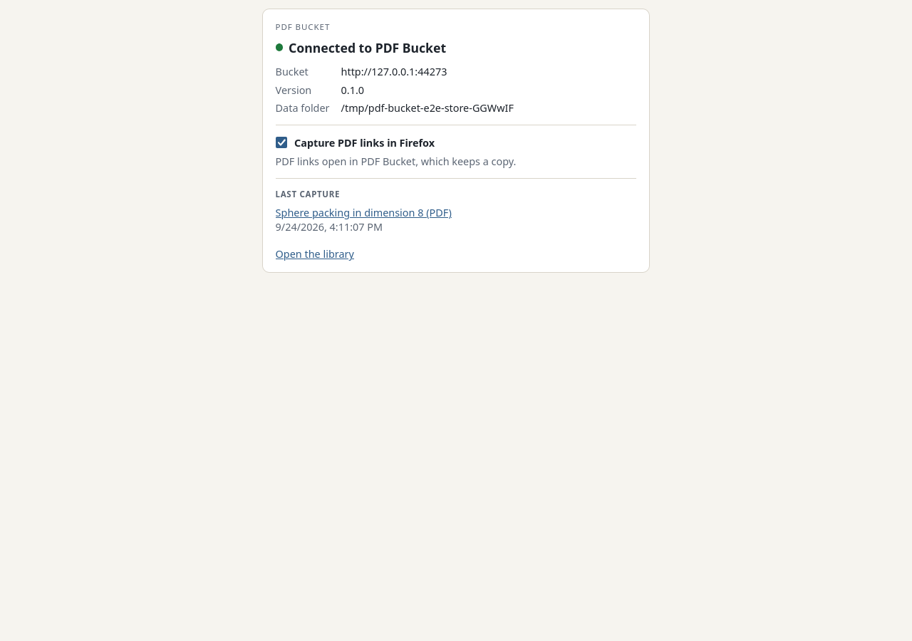
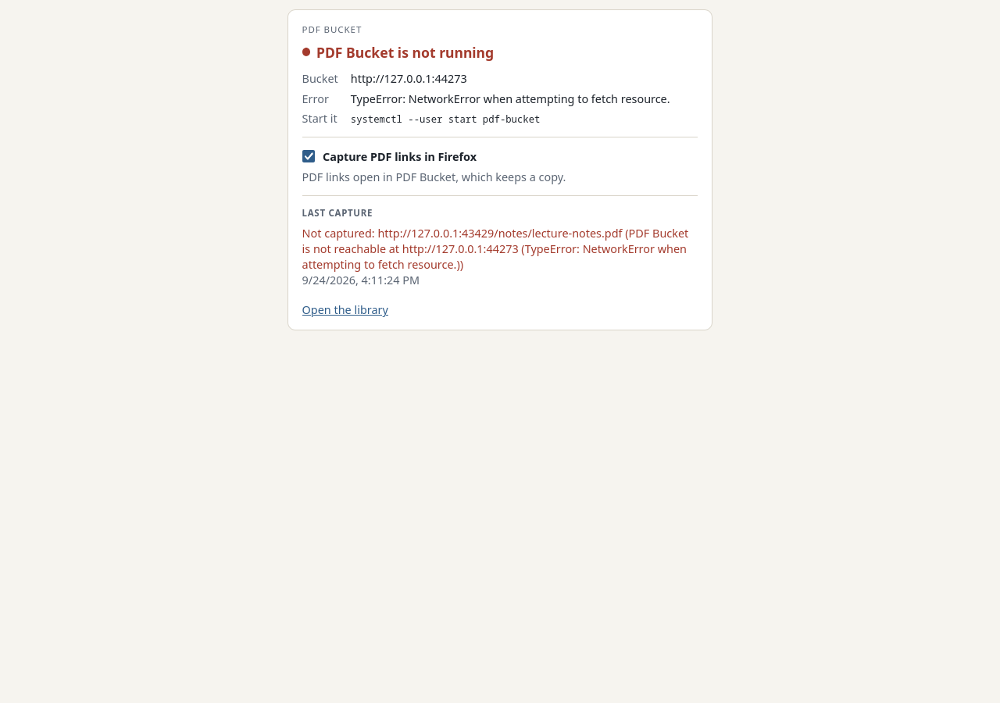

# M1 evidence: capture extension for Chrome and Firefox

Recorded on 2026-09-23 on the development workstation (Arch Linux, Hyprland 0.56, Chromium 153, Firefox 156, WebKitGTK 2.52.6).

## How capture works

- **Interception.** One WXT source tree (`src/extension`) builds both extensions.

  - Chrome registers the declarativeNetRequest rules in `src/extension/interception.ts` at service-worker start.
    They are the mozilla/pdf.js `pdfHandler.js` rules, restricted to GET and with an allow rule for the bucket origin.

  - Firefox has no response-header rule condition, so it evaluates the same decision (`isPdfResponse`) in a blocking `webRequest.onHeadersReceived` listener.

  - Chrome turns a main-frame PDF response into a download: the rule rewrites its `Content-Type` to `application/octet-stream`, which Chrome saves instead of rendering, so the PDF is fetched once and a signed or single-use URL holds.
    `src/extension/chrome-downloads.ts` marks each such navigation from its response headers (`webRequest.onHeadersReceived`, the same `isPdfResponse` decision), matches the download Chrome starts for that URL, and hands the saved file's path to the bucket at `/capture-download`; once stored, the download is removed.
    A download without a mark (a link the user saved, a PDF opened natively) is left alone.
    Chrome redirects sub-frame PDF responses to `capture.html?<PDF URL>`.

  - Firefox keeps the response itself: a `webRequest.filterResponseData` stream filter takes the PDF's bytes, and the frame gets a short HTML document in their place that opens `capture.html?<PDF URL>` once the response has ended.
    A signed or single-use URL, the tab's container cookies and the site's session therefore all apply to the captured bytes.

  - `<embed>` and `<object>` loads (resource type `object`) are not intercepted.

- **Link origin.** A content script reports every followed link (page URL, link text, page title) to the background, keyed by the link's URL without its fragment.
  The background carries a report along every HTTP redirect of the navigation (`webRequest.onBeforeRedirect`), so a DOI or shortened link names the page it was on.
  The capture takes the report for the PDF URL once, and only within `capture.link_origin_max_age_seconds` of the click.
  Reports live in the extension's session storage, which the browser clears on restart and on extension update.
  The capture uses the report for `source_url` and `title_hint`. With no report (a typed-in URL or a framed PDF), the capture has no `source_url` and the title is the filename.

- **Capture.** The capture page asks the background to capture the PDF. In Firefox the background posts the bytes the filter kept.
  Chrome gives an extension no way to read a navigation's body: a top-level PDF arrives as a download (above), and for a PDF in a frame the background fetches it again with the browser's cookies, which a single-use URL refuses.
  A failed Chrome download capture keeps the saved file and opens a capture page tab (`capture.html?<PDF URL>#<failure>`) that shows the failure and where the file is.
  The background posts to `/capture-bytes`, with the `Content-Disposition` filename, else the last URL segment decoded as far as it is valid UTF-8, as the file name the bucket derives the key from.
  The bucket's refusals are read as its error envelope; a failure anywhere in the extension also becomes a failed outcome, so the capture page always ends in a stored or failed state.
  What follows depends on the outcome:

  - stored (new or already present) in a tab: the desktop window opens the item, so the tab leaves the capture page.
    A tab that followed the link in place goes back to the linking page; a tab opened for the PDF alone (a `target=_blank` or middle-clicked link, a URL typed into a new tab) closes.
    The capture page tells them apart by its session history: a tab opened for the PDF holds one entry (MDN, History.length).

  - stored in a frame: the frame shows one line, the item's title linked to its reader page.

  - failed: the page stays with the error, the PDF URL and a link that opens the PDF natively.

- **Hand-back.** In a sub-frame smaller than `capture.min_frame_width` × `capture.min_frame_height` (`pdf-bucket.config.json`), the capture page registers a (tab, URL) exemption and reloads the PDF in the browser's viewer.
  The native-open link uses the same exemption: a Chrome session rule scoped by `tabIds`, or an in-memory set in Firefox.
  The exemption is cleared when the tab closes.
  When the background has not registered the exemption within `capture.native_open_timeout_seconds`, the capture page shows the failure and stays.

- **Window.** After every capture, new or existing, the server sends an `open-reader` event on `GET /api/events`. The library subscribes to that stream and opens the item's reader in a tab, or shows its tab when it is open (`src/web/tabs.tsx`). The Tauri main window also has an initialization script (main frame only, bucket origin only) that subscribes to the stream and shows and focuses the window.
  Reader pages opened in a browser tab do not have the listener.

- **Toolbar button and status page.** The toolbar button's popup, which is also the options page (`entrypoints/popup`), reads `GET /status` when it opens.
  It shows the bucket's address, version and data folder, or the connection error and the command that starts the app (`gtk-launch pdf-bucket-desktop`). An answer on the bucket's port that is not a PDF Bucket status report counts as unreachable.
  When the bucket cannot check its data folder (a `stat` or `access` call on it fails other than with "does not exist" or "not writable"), `/status` answers 500 with a `storage_check_failed` error that carries the operating system's error, and the page shows that error.
  It also shows the capture switch for this browser and the last capture from this browser: stored, stored without metadata (with the resolver's failure), or failed.
  The badge shows `ON` (the bucket is ready and capture is on), `OFF` (capture is off), or `!` (the bucket is unreachable, cannot store PDFs, or cannot check its data folder).
  The background refreshes the badge at startup, every minute (`alarms`), after each capture, and when the switch changes.

- **Capture switch.** The switch is `captureEnabled` in `storage.local`, and it starts on.
  While it is off, Chrome has no dynamic capture rules, and Firefox's listener lets every response through.
  The Firefox listener is registered when the background starts and waits for the stored value, so no navigation passes before the switch is read.

- **Bucket origin.** The extension reads the bucket host and port from `pdf-bucket.config.json` at build time (`extensionDefine` in `wxt.config.ts`). The Tauri crate reads them at compile time.

## Browser end-to-end suite

```console
$ just test-capture
 42 pass
 0 fail
Ran 42 tests across 1 file. [82.32s]
```

`tests/capture-e2e.test.ts` builds both extensions against an in-process bucket on a free port and drives them with Puppeteer:

- Chromium: `enableExtensions`.

- Firefox: WebDriver BiDi `webExtension.install`, with `-remote-allow-system-access` so that BiDi can script the moz-extension capture page.

The fixture site (`tests/fixture-site.ts`) sets a per-run session value on every page, and every PDF route returns 403 without it.
A capture that does not send the browser's session credentials therefore fails.
The suite is part of `bun test`. The whole suite (26 tests) runs in about 38 s.

| Fixture case | Expected | Chromium | Firefox |
| --- | --- | --- | --- |
| arXiv `/pdf/2401.00001` (no `.pdf`, `application/pdf`) | intercepted, tab back on the linking page | `2401.00001.pdf` stored; tab on `/abs/2401.00001` | same |
| `target=_blank` link to `/notes/survey.pdf` | intercepted, new tab closed | `survey.pdf` stored; the tab is gone, the linking tab stays | same |
| `/notes/lecture-notes.pdf` | intercepted | `lecture-notes.pdf` stored | `lecture-notes.pdf` stored |
| `/download?id=problem-set`, `application/octet-stream`, `Content-Disposition: attachment; filename="problem-set.pdf"` | intercepted | `problem-set.pdf` stored | `problem-set.pdf` stored |
| inline `<embed>` 320×240 | left alone | not captured | not captured |
| POST form returning `application/pdf` | left alone | not captured, no GET re-fetch | not captured, no GET re-fetch |
| `<iframe>` 1000×700 | intercepted, one line in the frame | `chapter.pdf` stored | `chapter.pdf` stored |
| `<iframe>` 320×240 | left alone | handed back, frame shows the PDF | handed back, frame shows the PDF |
| bucket's own `/pdf/lecture-notes.pdf` | left alone | not captured | not captured |
| second visit to the lecture-notes link | existing item | same file, same hash | same file, same hash |
| bucket stopped | failure and native link | a capture page tab shows the failure and the saved file; link opens the PDF with one fetch | failure shown; link opens the PDF with one fetch |
| bucket stopped, `target=_blank` link | failure, a tab keeps it | the link's tab closes and a capture page tab shows the failure | the new tab shows the failure and stays open |
| status page after the arXiv capture | bucket and last capture shown | origin, version `0.1.0`, data folder, last capture linking `/read/2401.00001`; badge `ON` | same |
| capture switched off, arXiv link followed | left alone | PDF opens at its own URL with one fetch; badge `OFF` | same |
| switched back on, arXiv link followed | intercepted | stored (existing item); badge `ON` | same |
| status page with the bucket stopped | unreachable shown | origin and error shown; badge `!` | same |
| DOI link `/doi/10.5555/redirected`, 302 to `/articles/redirected.pdf` | intercepted, linking page recorded | `redirected.pdf` stored; `source_url` `/citation.html` | same |
| link to `/notes/fragment.pdf#page=2` | intercepted, linking page recorded, no fragment in `pdf_url` | `fragment.pdf` stored; `source_url` `/fragment.html` | same |
| `/notes/caf%E9.pdf` (Latin-1 escape) | intercepted under that name | `caf%E9.pdf` stored | same |
| gzip-encoded `/notes/compressed.pdf` | decoded PDF stored | hash of the decoded PDF | same |
| single-use `/once/ticket.pdf` (403 after the first request) | stored from the browser's one request (Chrome: its download, then removed) | `ticket.pdf` stored, one request | same |
| two 320×240 `<iframe>`s at once | both left alone | both frames show their PDF | same |
| another service answering HTML on the bucket's port | unreachable shown, capture failed | status says it is not a status report; badge `!`; capture page shows the foreign answer | same |

The suite waits for each capture on the bucket's own `open-reader` event stream, the one the desktop window follows.
For each intercepted case, the suite reads the stored file's embedded provenance with `pdfbucket read`. It checks `pdf_url`, `source_url` (the linking page), `title_hint` (the link text), and the SHA-256 of the served bytes.
The store directory holds exactly one file per intercepted URL.

## Capture page

A captured PDF leaves no page behind, so the capture page is only seen when a capture fails, or inside a frame.

Bucket stopped, at desktop width and at 400 px (Chromium), and in Firefox:

  

A large iframe captured in place, and the native-open link followed with the bucket stopped (Firefox):

 

## Status page

Connected, capture switched off, and the bucket stopped (Chromium at popup width):

  

Firefox, connected and with the bucket stopped:

 

## Desktop window follows captures

The bucket ran on its configured port over a temporary data root, and the window was started against it:

```console
$ XDG_DATA_HOME=$(mktemp -d) bun run src/server/index.ts &
$ cd desktop && bunx @tauri-apps/cli dev --no-watch --config '{"build":{"devUrl":"http://127.0.0.1:8770","beforeDevCommand":""}}'
$ curl -s -F "pdf=@tests/fixtures/long-notes.pdf;filename=long-notes.pdf;type=application/pdf" \
    -F pdf_url=https://www.math.example.edu/~author/long-notes.pdf \
    -F source_url=https://www.math.example.edu/~author/teaching.html \
    -F "title_hint=Long notes" http://127.0.0.1:8770/capture-bytes
```

The window before the capture, on the server root:


Six seconds after the capture, on `/read/long-notes`:


The follower script ran as traced: it loaded on the bucket origin with `window.__TAURI__` defined, opened the event stream, received `open-reader`, and both window commands resolved before the navigation.

Under Hyprland the focus request arrives as an xdg-activation request.
Hyprland marks the window urgent and gives it focus only when `focus_on_activate` holds for that window.
`desktop/hyprland/pdf-bucket.lua` turns that on for the bucket window alone (README, **Hyprland**). The navigation happens either way.

Recorded on 2026-09-24 with the installed binary, a scratch data root, and Chromium focused on the same workspace.
The Hyprland event socket showed:

| Rule loaded | Events after the capture | Focus afterwards |
| --- | --- | --- |
| no | `urgent>>` | Chromium |
| yes | `urgent>>`, `activewindow>>pdf-bucket-desktop` | the bucket window, with the pointer moved to its centre |

With `input.follow_mouse = 1`, the bucket window keeps focus until the pointer next moves over another window.
