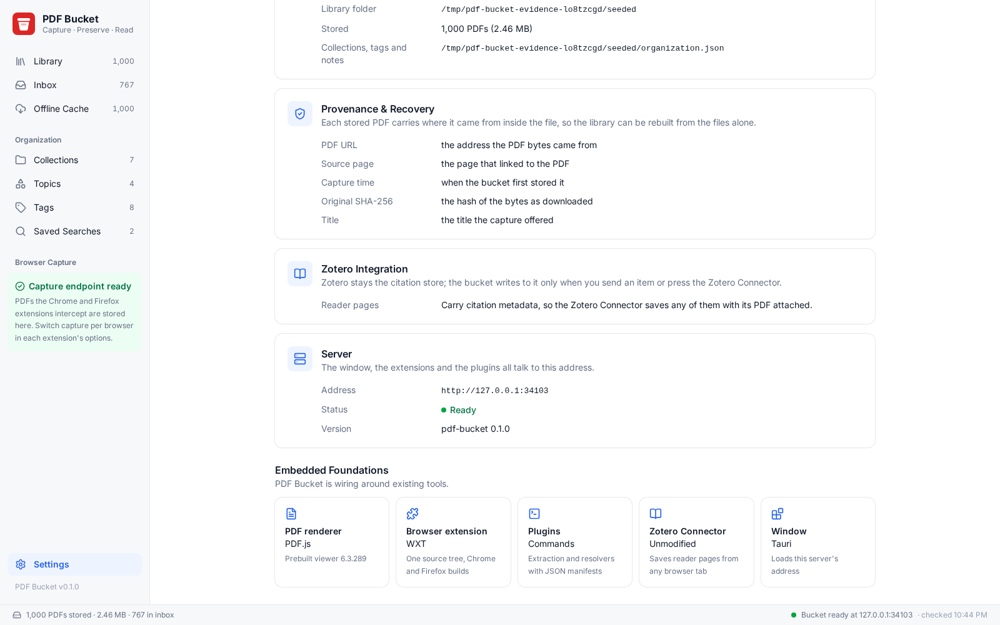

# M2 evidence: library UI over the bucket store

Recorded on 2026-09-23 on the development workstation (Arch Linux, WebKitGTK 2.52.6, Playwright Chromium build 1243).

## How the evidence is produced

```console
$ just library-screenshots
```

The recipe builds the web bundle, then `scripts/library_screenshots.py`:

1. makes three bucket roots in a temporary directory: an empty one; one holding `hand-copied.pdf`, a PDF with no embedded provenance; and one seeded with 1,000 PDFs by `scripts/seed_bucket.py`, which stores generated one-page PDFs through `pdfbucket.store.store_pdf`, so each carries embedded provenance exactly as a capture does;

2. serves each root with `src/server/serveBucket.ts` on a free port (never the configured 8770);

3. files the 300 most recent seeded items through the library API: six collections (two of them subcollections), four topics, seven tags, two notes, two saved searches;

4. screenshots every state in Playwright's Chromium at 1600x1000, the mockups' size;

5. screenshots the library and the reader in the system WebKitGTK, the engine of the Tauri window, through `WebKitWebDriver` on a headless Weston display of 1400x900, the window's default size.

Playwright's own WebKit build is not used: its Linux build needs Ubuntu 24.04 libraries (ICU 74, `libxml2.so.2`, flite) that Arch does not ship.

## 1,000-item load and filter times

Seconds, from the run that produced the screenshots below and from a run on an idle machine.

| Measurement | Screenshot run | Idle run |
| --- | --- | --- |
| Seed 1,000 PDFs through the store | 4.25 | 1.59 |
| `pdfbucket list` over 1,000 PDFs (one process) | 1.14 | 0.37 |
| `GET /api/library`, first request (index built from the files) | 1.18 | 0.38 |
| `GET /api/library`, second request (index cached, files re-stat'ed) | 0.020 | 0.013 |
| Window navigation to all 1,000 rows in the table | 0.46 | 0.38 |
| Typing a two-word filter until the table shows the matches | 0.16 | 0.08 |

The first request reads provenance out of every PDF; later requests re-read only PDFs whose modification time or size changed.
Filtering is the fzf filter over the item array in the browser; there is no search index.

## States

### Empty bucket


### Loading

The library request is held open while this is taken.


### Store failure

A PDF under the root without embedded provenance fails the listing loudly.
The headline is the store's last line; the full store output is folded below it.


### Library, populated (mockup 1)


Compared with mockup 1: the sidebar (Library, Inbox, Offline Cache with counts; Collections, Topics, Tags, Saved Searches with counts; browser capture panel; Settings), the search bar with its shortcut, Filters and New Collection, the table (title with PDF mark, source domain, date added, tag pills with overflow count), the inspector (Details and Notes tabs; source with Visit source, source URL, PDF URL, first captured, file path, cache status with size, SHA-256 with copy buttons; collections, topics and tags as editable pills) and the status bar are present.
Differences are listed under [Mockup elements not reproduced](#mockup-elements-not-reproduced).

Filtering, the filters dialog, the notes tab, adding a tag from the inspector:

   

The command palette, items and commands:

 

In WebKitGTK at the window's 1400x900, the inspector overlays the table instead of narrowing it:


### Reader (mockup 2)

`/read/<key>` keeps M0's `citation_*` meta tags; the page adds a bar back to the library and the provenance panel read from the PDF.

 

Compared with mockup 2: title and capture line, back to the library, the PDF.js toolbar (page navigation, zoom, find, outline sidebar, annotation tools), and the panel's source information, capture details (first captured, file path, file size, SHA-256), collections, topics, tags and notes are present.

### Collections, topics, tags, saved searches (mockup 3)

   

Creating a collection from the New Collection dialog opens it:

 

Compared with mockup 3: the Collections / Topics / Tags / Saved Searches tabs, each entry with its count, subcollections nested under their parent, the selected entry's header (parent, name, count; New Subcollection, Rename, Delete for a collection; the stored query for a saved search) and its table.

### Settings (mockup 4)

 

Compared with mockup 4: Browser Capture, Offline Cache (library folder, stored count and size, the filing file), Provenance & Recovery (the embedded fields), Zotero Integration, and Embedded Foundations (PDF.js with the pinned version from `pdf-bucket.config.json`) are present, plus a Server section from `/status`.

## Mockup elements not reproduced

Each has no home in the reused components or in PDF.js, or belongs to a later milestone; none is drawn as a control that does nothing.
The roadmap card's Decision Log records them.

| Mockup | Element | Why it is absent |
| --- | --- | --- |
| 1 | Authors column and inspector field | Stored items carry no creators until the resolver plugins (M3) supply them. |
| 1 | Status column (Cached, Offline, Needs re-fetch) | Every stored item is a local file by construction; the inspector's cache status shows it with the size. Re-fetch is M5. |
| 1 | Quick filters (Unread, Cached Offline, Needs Re-fetch, Added This Week), sort menu, grid view | No read state or re-fetch state exists; sorting is by column header. |
| 1 | Import URL, Add Folder | Capture from the browser is the only ingest path in the roadmap. |
| 1 | Row checkboxes, bulk tag | The reused table selects one row. |
| 1 | First-page thumbnail, Related tab | Needs PDF rendering in the library window; PDF.js runs in the reader page. |
| 1 | Last verified, mirror URLs | Later enrichment (mirrors) and M5 (re-checking URLs). |
| 1 | Reveal Cache, Send to Zotero | Opening the folder needs a desktop action; sending is M3. |
| 1, 4 | Chrome and Firefox toggles | They live in each extension's options page (M1). The sidebar and settings show the capture endpoint's state instead. |
| 2 | Collection list column beside the reader | The reader is its own page; it links back to the library. |
| 2 | Rebuild from metadata | The cache-rebuild recipe is M5. |
| 3 | Collection cards with descriptions, pins, offline toggle, recent activity | Collections carry a name and a parent only; entries render as the reused tree list. |
| 3 | Smart collection rule builder | Saved searches are stored queries of the filter dialog; the header shows the stored query. |
| 4 | Capture behaviour, file naming, cache size, retention, redownload, Zotero target and mapping controls | No setting exists behind them; the sections state what the app does. |
| 4 | Research jumping-off points panel | A planning checklist, not an app function. |
