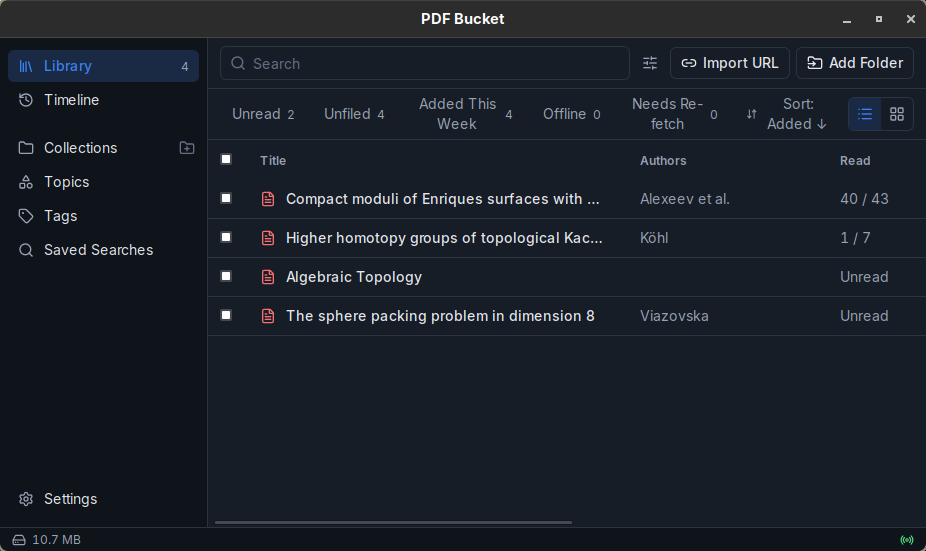
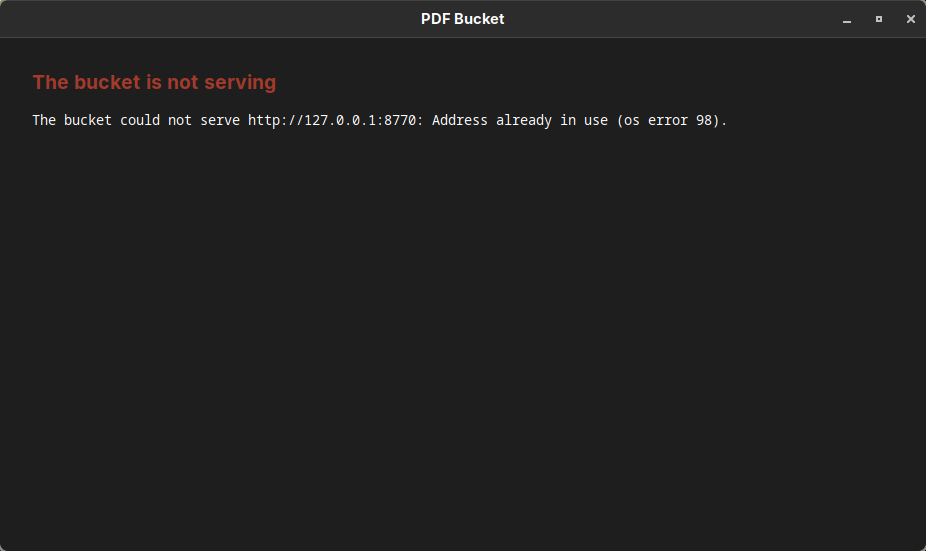

# M5 evidence: the app runs the bucket, and cache regeneration

Recorded on 2026-09-24 and 2026-09-25 on the development workstation (Arch Linux, systemd user manager, Hyprland 0.56.2).

## The app runs the bucket

PDF Bucket runs while its desktop app runs, the way Zotero's local API runs inside Zotero: the app is the bucket's server.
The release app (`desktop/src-tauri/src/lib.rs`, the server crate `server/`):

- **Start.** Before it builds the window, the app reads the environment the checkout's `.envrc` sets (`direnv export json`, which carries the extraction providers' keys) on top of the PATH of its build, creates the data root, checks that the PDF.js viewer is unpacked, and binds the configured port on Tauri's tokio runtime (`pdf_bucket::serve`). The window opens on the app's own page and moves to the bucket at once, because the port is already answering.
  The store and the plugins run as commands with that environment.

- **Stop.** The server is part of the process: tray Quit, SIGTERM, SIGKILL and a crash all end it, and the port is free when the process is gone.

- **Failure.** When the bucket cannot serve (the port is taken, the `.envrc` is blocked, the viewer is missing) or its server task ends, the window shows why and comes forward.

- **Index export.** The server rewrites `$XDG_DATA_HOME/pdf-bucket-export/index.json` after every capture and filing change (`IndexExporter`, `server/src/export.rs`).

Under `just run` (`tauri dev`) the app serves the configured bucket the same way.

Recorded on 2026-09-25 with the provisioned release app on the configured port (8770), started through its systemd unit:

| Action | Result |
| --- | --- |
| start the app, three times | `/status` answers after 148, 153 and 182 ms; the first `/api/library` after 527–560 ms (the store reads the four stored PDFs); `pdf-bucket-desktop` itself holds the port |
| second launch while running | exits 0; one app process |
| SIGTERM to the app | app gone; nothing listens on the port |
| SIGKILL to the app | app gone; nothing listens on the port |
| port already taken | the window shows the bind error; the holder keeps the port |
| `.envrc` never allowed | the window shows direnv's message; nothing listens on the port |

The last row was recorded by removing the checkout's allow entry (the `allowPath` that `direnv status` names).
`direnv deny` does not block the file in direnv 2.37.1: the allow entry stays, and `direnv export json` and `direnv exec` load the `.envrc` and exit 0.






## Install and login

`just provision` builds the web bundle, the pinned PDF.js viewer and the release app (`tauri build --no-bundle`), quits a running PDF Bucket, installs the app at `~/.local/bin/pdf-bucket-desktop` with its icon (`hicolor`, 32×32 and 128×128) and `pdf-bucket-desktop.desktop` as both the launcher entry (`$XDG_DATA_HOME/applications`) and the login autostart entry (`~/.config/autostart`), and starts it.
The entry and icon are named after the window's Wayland app_id, the binary name.

Desktop sessions that run XDG autostart start the app at login from the autostart entry.
This Hyprland session runs no XDG autostart: `~/.config/hypr/confs/startup.lua` starts `hyprland-session.target`. `systemd-xdg-autostart-generator(8)` turns the autostart entry into `app-pdf\x2dbucket\x2ddesktop@autostart.service`, and `just provision` installs a drop-in, `~/.config/systemd/user/hyprland-session.target.d/pdf-bucket.conf` (`desktop/autostart/hyprland-session.conf`), that makes the session target want that one unit.
home-manager's Hyprland module (`modules/services/window-managers/hyprland/default.nix`, `systemd.enableXdgAutostart`) instead adds `Wants=xdg-desktop-autostart.target` to the session target; on this machine that target would also start the fourteen other units the generator makes for this session (`XDG_CURRENT_DESKTOP=Hyprland`), among them nm-applet, dropbox and bitwarden, which `startup.lua` already starts, and picom, an X11 compositor.

## Tray and window

- **Tray icon.** A StatusNotifierItem with a two-item menu: Show PDF Bucket and Quit PDF Bucket.
  Linux tray icons report no clicks (tray-icon 0.24 through libayatana-appindicator), so any click opens the menu.

- **Close.** Closing the window hides it (`CloseRequested` → `prevent_close` + `hide`). The app keeps serving the bucket.

- **Second launch.** `tauri-plugin-single-instance` holds `com.dzackgarza.pdfbucket.SingleInstance` on the session bus.
  A second launch exits before binding the bucket's port, and the running app shows its window.

- **Focus after show.** The follower script asks for focus when the page becomes visible, on its next animation frame.
  A focus request sent with the show arrives before the compositor maps the window, and Hyprland ignores it.

Recorded on 2026-09-24. Chromium had focus on the same workspace, and events were read from the Hyprland event socket.

| Action | Result |
| --- | --- |
| provisioning | tray item `tray_icon_tray_app_main` registered with `org.kde.StatusNotifierWatcher`; the icon appears in waybar's tray |
| close the window (`hl.dsp.window.close`) | no mapped window; app and tray item alive |
| capture while hidden 2 s, 30 s, 60 s (scratch data root) | window mapped again; with the rule in `desktop/hyprland/pdf-bucket.lua` loaded, `urgent>>`, `openwindow>>`, `activewindow>>pdf-bucket-desktop` |
| `gtk-launch pdf-bucket-desktop` while hidden | one process; `urgent>>` (before the map, ignored), `openwindow>>`, `urgent>>`, `activewindow>>pdf-bucket-desktop` |
| tray Show while hidden | `openwindow>>`, `urgent>>`, `activewindow>>pdf-bucket-desktop` |

## Extension builds

`just build` runs `bun run build` (web bundle, `wxt build`, `wxt zip -b firefox`) and then the Tauri bundle build (deb, rpm, AppImage; `NO_STRIP=true` because linuxdeploy's `strip` cannot read the `.relr.dyn` sections of Arch's libraries).
WXT's `outDir` is `dist`. After `just build` (exit 0), with the provisioned window running:

```console
$ find dist -maxdepth 2 -not -path 'dist/web/*' -not -path '*/assets' -not -path '*/chunks' -not -path '*/content-scripts' | sort
dist
dist/chrome-mv3
dist/chrome-mv3/background.js
dist/chrome-mv3/capture.html
dist/chrome-mv3/manifest.json
dist/firefox-mv2
dist/firefox-mv2/background.js
dist/firefox-mv2/capture.html
dist/firefox-mv2/manifest.json
dist/pdf-bucket-0.1.0-firefox.zip
dist/web
$ jq -c '{manifest_version, name, permissions, gecko: .browser_specific_settings.gecko.id}' dist/chrome-mv3/manifest.json dist/firefox-mv2/manifest.json
{"manifest_version":3,"name":"PDF Bucket","permissions":["declarativeNetRequestWithHostAccess","storage"],"gecko":null}
{"manifest_version":2,"name":"PDF Bucket","permissions":["webRequest","webRequestBlocking","storage","<all_urls>"],"gecko":"pdf-bucket@dzackgarza.com"}
```

The app runs the copy of the desktop binary that `just provision` installs at `~/.local/bin/pdf-bucket-desktop`, so `just build` and `just run` rewrite the build tree while it runs.
The extensions were not installed into the workstation's browsers by this milestone.

The README section **Browser extensions** gives the install steps: load-unpacked for Chrome and Chromium; for Firefox, a temporary add-on in any build, a permanent unsigned install in Developer Edition, Nightly or ESR with `xpinstall.signatures.required=false`, or an unlisted AMO signature (`web-ext sign --channel unlisted`) for release Firefox, which this workstation runs (Firefox 156.0).

## Index export and cache rebuild

`just export-index` writes `$XDG_DATA_HOME/pdf-bucket-export/index.json`: `version`, the collections and saved searches of `organization.json`, and one entry per stored PDF in key order with its embedded provenance (`pdf_url`, `source_url`, `captured_at`, `original_sha256`, `title_hint`), its title and authors, and its filing (tags, collections, notes, reading position, source checks, mirrors, `modifiedAt`). The export is outside the store root, so wiping or losing the store leaves it, and its fixed order makes two exports diff line by line under any backup or version control that holds the file.
It refuses to overwrite an export that lists an item whose PDF is missing (naming the keys, and exiting 1), since that export is the only record able to restore it.

`just import-index [file]` writes the export's filing into a data root that has no `organization.json`. `just rebuild-cache` downloads each listed PDF the root lacks from its `pdf_url`, then from each mirror in turn (`rebuild.concurrent_downloads` at once, `rebuild.download_timeout_seconds` each, from `pdf-bucket.config.json`), compares the bytes with `original_sha256`, and stores a match under the same key through `pdfbucket restore`, which embeds the recorded provenance and refuses any other bytes; a title and authors a resolver gave are recorded again.
It prints one outcome per item — `present`, `restored` (with the URL it came from), or `unrestored` with each URL tried and what it gave: `dead` (HTTP status or network error) or `changed` (the hash it serves; nothing stored) — and exits 1 unless every item is present or restored.
The library window does the same per item: an item the export holds whose PDF is gone is listed under Needs Re-fetch, with Rebuild beside it.

The running server writes the same export after every capture and filing change; `tests/index-export.test.ts` ("the running server rewrites the index export after a capture, a filing change and a delete") captures, tags and deletes a PDF through the server and reads each change back from the export.

### Evidence run

`just cache-evidence` (`tests/cache-evidence.ts`) runs the recipes on a temporary `XDG_DATA_HOME`; an in-process HTTP server stands in for the publishers and serves the committed fixture PDFs.
Tests: `tests/index-export.test.ts` (rebuild outcomes, round trip, refusals) and `tests/test_store.py` (`restore`).

```console
XDG_DATA_HOME=/tmp/pdf-bucket-m5-evidence-hbtNmo
publisher http://127.0.0.1:42739

captured lecture-notes from http://127.0.0.1:42739/notes/lecture-notes.pdf
captured 2401.00001 from http://127.0.0.1:42739/pdf/2401.00001
captured ten-page-notes from http://127.0.0.1:42739/teaching/ten-page-notes.pdf
captured long-notes from http://127.0.0.1:42739/papers/long-notes.pdf
filed lecture-notes and 2401.00001 into Quadratic forms, with tags

## Export, wipe, import, rebuild, export again, diff

$ just export-index
exported 4 items to /tmp/pdf-bucket-m5-evidence-hbtNmo/pdf-bucket-export/index.json
(exit 0)

$ trash /tmp/pdf-bucket-m5-evidence-hbtNmo/pdf-bucket
(exit 0)

$ just import-index
imported the filing of 2 items into /tmp/pdf-bucket-m5-evidence-hbtNmo/pdf-bucket
(exit 0)

$ diff <(jq -S . /tmp/pdf-bucket-m5-evidence-hbtNmo/organization-before.json) <(jq -S . /tmp/pdf-bucket-m5-evidence-hbtNmo/pdf-bucket/organization.json) && echo organization.json identical
organization.json identical
(exit 0)

$ just rebuild-cache
[
  {
    "status": "restored",
    "from": "http://127.0.0.1:42739/pdf/2401.00001",
    "key": "2401.00001",
    "stored_sha256": "98f729a0ab586c92bc8276c8942d5b154930118bac9bbbb7b2b4eac3d6f50a67"
  },
  {
    "status": "restored",
    "from": "http://127.0.0.1:42739/notes/lecture-notes.pdf",
    "key": "lecture-notes",
    "stored_sha256": "cdbd50d77ebf27185a87bbc8274359afa1bbe8a5689df19b4cb8cfd5e2e4e56c"
  },
  {
    "status": "restored",
    "from": "http://127.0.0.1:42739/papers/long-notes.pdf",
    "key": "long-notes",
    "stored_sha256": "080842486528f6476455a8dc82eaa696342f616b552debce6dc6f2a904415c4f"
  },
  {
    "status": "restored",
    "from": "http://127.0.0.1:42739/teaching/ten-page-notes.pdf",
    "key": "ten-page-notes",
    "stored_sha256": "cfbfdb5cf5af17dd517c5f1333d84d0f24ebfa75dc77d7ebbe22303ba16eafef"
  }
]
(exit 0)

$ just export-index
exported 4 items to /tmp/pdf-bucket-m5-evidence-hbtNmo/pdf-bucket-export/index.json
(exit 0)

$ diff /tmp/pdf-bucket-m5-evidence-hbtNmo/export-1.json /tmp/pdf-bucket-m5-evidence-hbtNmo/pdf-bucket-export/index.json && echo exports identical
exports identical
(exit 0)

## Delete three PDFs, one of them now at a dead URL; rebuild

the publisher now answers 404 at http://127.0.0.1:42739/papers/long-notes.pdf
deleted lecture-notes.pdf
deleted 2401.00001.pdf
deleted long-notes.pdf

$ just rebuild-cache
[
  {
    "status": "restored",
    "from": "http://127.0.0.1:42739/pdf/2401.00001",
    "key": "2401.00001",
    "stored_sha256": "9081209f6cd9f23538c4366415c117aa036fa2db304d06b7831f2444129f5353"
  },
  {
    "status": "restored",
    "from": "http://127.0.0.1:42739/notes/lecture-notes.pdf",
    "key": "lecture-notes",
    "stored_sha256": "5aeacba4e58d2baf47649f16c0dc6a5f37db64ed946b5a8887fa13bb3adf08d5"
  },
  {
    "status": "unrestored",
    "attempts": [
      {
        "detail": "HTTP 404",
        "status": "dead",
        "url": "http://127.0.0.1:42739/papers/long-notes.pdf"
      }
    ],
    "key": "long-notes"
  },
  {
    "status": "present",
    "key": "ten-page-notes"
  }
]
error: recipe `rebuild-cache` failed on line 51 with exit code 1
(exit 1)

$ ls /tmp/pdf-bucket-m5-evidence-hbtNmo/pdf-bucket
2401.00001.pdf
lecture-notes.pdf
organization.json
ten-page-notes.pdf
(exit 0)

## Recorded original hash of each stored PDF against the fixture it came from

$ uv run --locked pdfbucket describe /tmp/pdf-bucket-m5-evidence-hbtNmo/pdf-bucket lecture-notes | jq -r '"\(.key) \(.provenance.original_sha256)"'
lecture-notes 5e340929db3bf5002c7a87ad166fbb4e9673bf99e8a61f6f3a92f4904e043a25
(exit 0)

fixture lecture-notes.pdf 5e340929db3bf5002c7a87ad166fbb4e9673bf99e8a61f6f3a92f4904e043a25

$ uv run --locked pdfbucket describe /tmp/pdf-bucket-m5-evidence-hbtNmo/pdf-bucket 2401.00001 | jq -r '"\(.key) \(.provenance.original_sha256)"'
2401.00001 429096666cf6b66a9bc55114aeef362934801178e19f1b45ba5c3de6072b960e
(exit 0)

fixture problem-set.pdf 429096666cf6b66a9bc55114aeef362934801178e19f1b45ba5c3de6072b960e

$ uv run --locked pdfbucket describe /tmp/pdf-bucket-m5-evidence-hbtNmo/pdf-bucket ten-page-notes | jq -r '"\(.key) \(.provenance.original_sha256)"'
ten-page-notes 2cc26c66bfb63abe950e12cb71b40046d7e375858c50dd09fde4502d5d4d3b22
(exit 0)

fixture ten-page-notes.pdf 2cc26c66bfb63abe950e12cb71b40046d7e375858c50dd09fde4502d5d4d3b22

long-notes: no stored PDF
```
