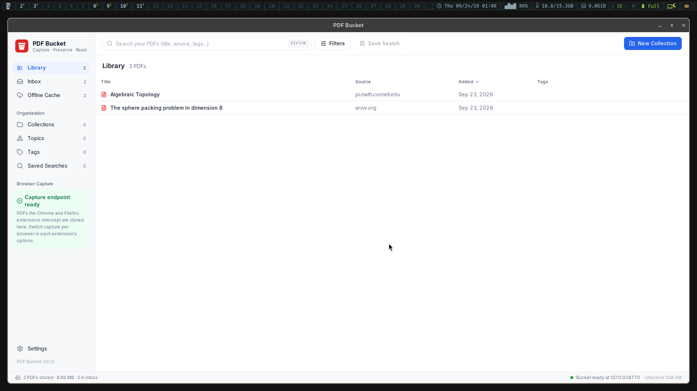
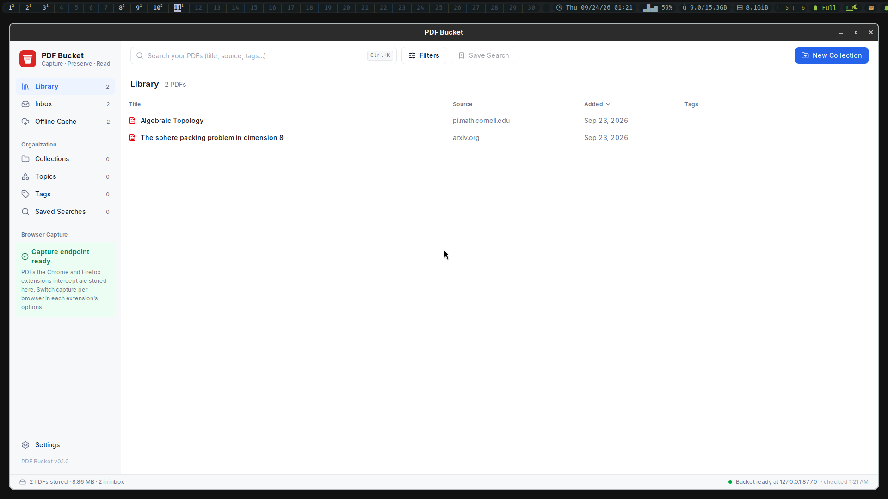

# M5 evidence: always-on provisioning and cache regeneration

Recorded on 2026-09-24 on the development workstation (Arch Linux, systemd user manager, Hyprland 0.56.2).

## Provisioning

`just provision` builds what the running bucket needs — the web bundle (`dist/web`), the pinned PDF.js viewer (`vendor/`) and the release desktop binary (`tauri build --no-bundle`) — then renders the templates in `systemd/` for the checkout it runs in, checks them with `systemd-analyze --user verify`, and enables and starts them in `~/.config/systemd/user`:

| Unit | Wanted by | Runs |
| --- | --- | --- |
| `pdf-bucket.service` | `default.target` | `direnv exec <checkout> bun run src/server/index.ts` with `NODE_ENV=production`; `direnv` supplies the extraction providers' keys |
| `pdf-bucket-window.service` | `graphical-session.target` | `~/.local/bin/pdf-bucket-desktop`, the release binary `just provision` installs, after `curl` gets an answer from `/status`; `Requires=pdf-bucket.service` |
| `pdf-bucket-export.timer` | `timers.target` | `pdf-bucket-export.service` (`bun run src/server/indexCli.ts export`) every hour, `Persistent=true` |

The desktop binary loads the configured origin itself: `desktop/src-tauri/src/lib.rs` sets the main window's URL to `http://<host>:<port>` from `pdf-bucket.config.json` at compile time, the same way it scopes the follower script.
The server and window units set `Restart=on-failure` with `StartLimitBurst=3` in `StartLimitIntervalSec=120`: a failing start is retried, then the unit stays failed with the exit status and the server's error in the journal.
Every start in the interval counts toward the limit, including manual ones.

The units are installed from this worktree (`/home/dzack/gitclones/math-pdf-reader-m5`) and left enabled and running.
After the branch merges, run `just provision` once in the main checkout; it rewrites the same four unit files to point there.

### After a reboot

A real reboot or a new login was not performed.
The reboot-equivalent below reloads the unit files and restarts both services, then shows that the units are enabled and hooked into the targets a login reaches.

```console
$ systemctl --user daemon-reload && systemctl --user restart pdf-bucket.service pdf-bucket-window.service
(exit 0)
$ systemctl --user is-enabled pdf-bucket.service pdf-bucket-window.service pdf-bucket-export.timer
enabled
enabled
enabled
$ systemctl --user list-dependencies --plain default.target | grep pdf-bucket
  pdf-bucket.service
  pdf-bucket-export.timer
$ systemctl --user list-dependencies --plain graphical-session.target | grep pdf-bucket
  pdf-bucket-window.service
  pdf-bucket-export.timer
$ systemctl --user status --lines=4 pdf-bucket.service pdf-bucket-window.service pdf-bucket-export.timer
● pdf-bucket.service - PDF Bucket server on http://127.0.0.1:8770
     Loaded: loaded (/home/dzack/.config/systemd/user/pdf-bucket.service; enabled; preset: enabled)
     Active: active (running) since Thu 2026-09-24 01:08:16 CST; 1s ago
       Docs: file:///home/dzack/gitclones/math-pdf-reader-m5/docs/m5.md
   Main PID: 1631537 (bun)
     CGroup: /user.slice/user-1000.slice/user@1000.service/app.slice/pdf-bucket.service
             └─1631537 /bin/bun run src/server/index.ts

Sep 24 01:08:16 bahamut systemd[1165]: Starting PDF Bucket server on http://127.0.0.1:8770...
Sep 24 01:08:16 bahamut systemd[1165]: Started PDF Bucket server on http://127.0.0.1:8770.
Sep 24 01:08:16 bahamut direnv[1631537]: Started server: http://127.0.0.1:8770

● pdf-bucket-window.service - PDF Bucket window on http://127.0.0.1:8770
     Loaded: loaded (/home/dzack/.config/systemd/user/pdf-bucket-window.service; enabled; preset: enabled)
     Active: active (running) since Thu 2026-09-24 01:08:17 CST; 149ms ago
       Docs: file:///home/dzack/gitclones/math-pdf-reader-m5/docs/m5.md
    Process: 1631538 ExecStartPre=/usr/bin/curl --silent --show-error --fail --output /dev/null --retry 30 --retry-delay 1 --retry-connrefused http://127.0.0.1:8770/status (code=exited, status=0/SUCCESS)
   Main PID: 1631681 (pdf-bucket-desk)
     CGroup: /user.slice/user-1000.slice/user@1000.service/app.slice/pdf-bucket-window.service
             └─1631681 /home/dzack/.local/bin/pdf-bucket-desktop

Sep 24 01:08:16 bahamut systemd[1165]: Starting PDF Bucket window on http://127.0.0.1:8770...
Sep 24 01:08:16 bahamut curl[1631538]: curl: (7) Failed to connect to 127.0.0.1:8770 after 0 ms: Could not connect to server
Sep 24 01:08:17 bahamut systemd[1165]: Started PDF Bucket window on http://127.0.0.1:8770.

● pdf-bucket-export.timer - Hourly PDF Bucket index export
     Loaded: loaded (/home/dzack/.config/systemd/user/pdf-bucket-export.timer; enabled; preset: enabled)
     Active: active (waiting) since Thu 2026-09-24 00:58:41 CST; 9min ago
    Trigger: Thu 2026-09-24 02:00:00 CST; 51min left
   Triggers: ● pdf-bucket-export.service
       Docs: file:///home/dzack/gitclones/math-pdf-reader-m5/docs/m5.md

Sep 24 00:58:41 bahamut systemd[1165]: Started Hourly PDF Bucket index export.
$ curl -s http://127.0.0.1:8770/status | jq .
{
  "backend_url": "http://127.0.0.1:8770",
  "root": "/home/dzack/.local/share/pdf-bucket",
  "service": {
    "name": "pdf-bucket",
    "version": "0.1.0"
  },
  "storage": {
    "root_exists": true,
    "root_writable": true
  },
  "capabilities": {
    "capture": true
  },
  "ready": true
}
```

The window the unit started, moved to a headless output and captured there (`hyprctl output create headless`, `grim -o`): the built binary shows the library of the real bucket at `127.0.0.1:8770`.



### The graphical session starts the window

What comes up at login:

| Unit | Starts when | Pulled in by |
| --- | --- | --- |
| `pdf-bucket.service`, `pdf-bucket-export.timer` | the user manager starts, at login | `default.target`, `timers.target` |
| `pdf-bucket-window.service` | Hyprland has started and its session reaches `graphical-session.target` | `hyprland-session.target`, started from `startup.lua` |

systemd starts `graphical-session.target` only when a session-specific target binds to it (systemd.special(7)).
This Hyprland setup started its programs from `~/.config/hypr/confs/startup.lua` and never reached the target, so nothing started the window unit.
The window unit is not moved to `default.target`: the user manager reaches that before the compositor exists, so the window would start without a display.

Two changes outside this repository, made with the user's approval, give the session that target.
Neither `~/.config/hypr` nor `~/.config/systemd` is under version control; the original `startup.lua` was copied aside before the edit.
Both follow home-manager's Hyprland module (`nix-community/home-manager`, `modules/services/window-managers/hyprland`): the same target unit, and the same `dbus-update-activation-environment` line with its default variable list.

`~/.config/systemd/user/hyprland-session.target` (new):

```ini
# The Hyprland session as a systemd target: started from ~/.config/hypr/confs/startup.lua once
# the compositor's environment is in the user manager, it pulls in graphical-session.target and
# with it every user unit WantedBy that target.
# Pattern: systemd.special(7) (graphical-session.target is bound to by a session-specific
# target), as home-manager's Hyprland module writes it
# (nix-community/home-manager modules/services/window-managers/hyprland), the same shape as
# the Sway wiki's sway-session.target.
[Unit]
Description=Hyprland compositor session
Documentation=man:systemd.special(7)
BindsTo=graphical-session.target
Wants=graphical-session-pre.target
After=graphical-session-pre.target
```

`~/.config/hypr/confs/startup.lua`, the only change:

```diff
@@ -7,6 +7,7 @@
 
 -- `exec-once` = run only at compositor startup.
 hl.on("hyprland.start", function()
+    hl.exec_cmd("dbus-update-activation-environment --systemd DISPLAY HYPRLAND_INSTANCE_SIGNATURE WAYLAND_DISPLAY XDG_CURRENT_DESKTOP XDG_SESSION_TYPE && systemctl --user stop hyprland-session.target && systemctl --user start hyprland-session.target")
     hl.exec_cmd("hyprctl setcursor " .. cursor .. " 24")
     hl.exec_cmd(scripts_dir .. "/startup.sh & " .. scripts_dir .. "/polkit.sh")
     hl.exec_cmd(
```

`Hyprland --verify-config` answers `config ok` with the edit.
A real login was not performed.
Instead the line was run in the current session, after stopping the window unit and both session targets, and it started the window:

```console
$ systemctl --user stop pdf-bucket-window.service hyprland-session.target graphical-session.target
$ systemctl --user is-active hyprland-session.target graphical-session.target pdf-bucket.service pdf-bucket-window.service
inactive
inactive
active
inactive
$ dbus-update-activation-environment --systemd DISPLAY HYPRLAND_INSTANCE_SIGNATURE WAYLAND_DISPLAY XDG_CURRENT_DESKTOP XDG_SESSION_TYPE && systemctl --user stop hyprland-session.target && systemctl --user start hyprland-session.target
(exit 0)
$ systemctl --user is-active hyprland-session.target graphical-session.target pdf-bucket.service pdf-bucket-window.service
active
active
active
active
$ journalctl --user -o cat -u hyprland-session.target -u graphical-session.target -u pdf-bucket-window.service
Reached target Current graphical user session.
Reached target Hyprland compositor session.
Starting PDF Bucket window on http://127.0.0.1:8770...
Started PDF Bucket window on http://127.0.0.1:8770.
```

The window started this way, captured on a headless output:



The same target also starts the user's `reminder-ags.service`, which is enabled for `graphical-session.target` and had never started before.
It fails and was left unmodified: its `ExecStart` runs `ags run --gtk 4 /home/dzack/.config/ags/reminders/app.tsx`, that file does not exist (`stat ... no such file or directory`), and after five restarts the unit is `failed (Result: start-limit-hit)`.
It will fail the same way at every login until its unit or the missing file is fixed.

### A failing start is visible

With a placeholder listener holding port 8770, `systemctl --user start pdf-bucket.service`:

```console
$ systemctl --user status pdf-bucket.service
× pdf-bucket.service - PDF Bucket server on http://127.0.0.1:8770
     Loaded: loaded (/home/dzack/.config/systemd/user/pdf-bucket.service; enabled; preset: enabled)
     Active: failed (Result: start-limit-hit) since Thu 2026-09-24 00:56:25 CST; 5s ago
    Process: 1539969 ExecStart=/bin/direnv exec /home/dzack/gitclones/math-pdf-reader-m5 /bin/bun run src/server/index.ts (code=exited, status=1/FAILURE)
   Main PID: 1539969 (code=exited, status=1/FAILURE)

Sep 24 00:56:25 bahamut systemd[1165]: pdf-bucket.service: Scheduled restart job, restart counter is at 1.
Sep 24 00:56:25 bahamut systemd[1165]: pdf-bucket.service: Start request repeated too quickly.
Sep 24 00:56:25 bahamut systemd[1165]: pdf-bucket.service: Failed with result 'start-limit-hit'.
Sep 24 00:56:25 bahamut systemd[1165]: Failed to start PDF Bucket server on http://127.0.0.1:8770.
(exit 3)
$ journalctl --user -u pdf-bucket.service -o cat
...
error: Failed to start server. Is port 8770 in use?
 syscall: "listen",
    code: "EADDRINUSE"
pdf-bucket.service: Main process exited, code=exited, status=1/FAILURE
pdf-bucket.service: Failed with result 'exit-code'.
pdf-bucket.service: Scheduled restart job, restart counter is at 1.
pdf-bucket.service: Start request repeated too quickly.
pdf-bucket.service: Failed with result 'start-limit-hit'.
```

The listener was then stopped and both units started again (`systemctl --user reset-failed pdf-bucket.service && systemctl --user start pdf-bucket.service pdf-bucket-window.service`).

## Extension builds

`just build` runs `bun run build` (web bundle, `wxt build`, `wxt zip -b firefox`) and then the Tauri bundle build (deb, rpm, AppImage; `NO_STRIP=true` because linuxdeploy's `strip` cannot read the `.relr.dyn` sections of Arch's libraries). WXT's `outDir` is `dist`. After `just build` (exit 0), with the provisioned window running:

```console
$ find dist -maxdepth 2 -not -path 'dist/web/*' -not -path '*/assets' -not -path '*/chunks' -not -path '*/content-scripts' | sort
dist
dist/chrome-mv3
dist/chrome-mv3/background.js
dist/chrome-mv3/capture.html
dist/chrome-mv3/manifest.json
dist/firefox-mv2
dist/firefox-mv2/background.js
dist/firefox-mv2/capture.html
dist/firefox-mv2/manifest.json
dist/pdf-bucket-0.1.0-firefox.zip
dist/web
$ jq -c '{manifest_version, name, permissions, gecko: .browser_specific_settings.gecko.id}' dist/chrome-mv3/manifest.json dist/firefox-mv2/manifest.json
{"manifest_version":3,"name":"PDF Bucket","permissions":["declarativeNetRequestWithHostAccess","storage"],"gecko":null}
{"manifest_version":2,"name":"PDF Bucket","permissions":["webRequest","webRequestBlocking","storage","<all_urls>"],"gecko":"pdf-bucket@dzackgarza.com"}
```

The window unit runs a copy of the desktop binary that `just provision` installs at `~/.local/bin/pdf-bucket-desktop`, so `just build` and `just run` rewrite the build tree while the window runs.
The extensions were not installed into the workstation's browsers by this milestone.

The README section **Browser extensions** gives the install steps: load-unpacked for Chrome and Chromium; for Firefox, a temporary add-on in any build, a permanent unsigned install in Developer Edition, Nightly or ESR with `xpinstall.signatures.required=false`, or an unlisted AMO signature (`web-ext sign --channel unlisted`) for release Firefox, which this workstation runs (Firefox 156.0).

## Index export and cache rebuild

`just export-index` writes `$XDG_DATA_HOME/pdf-bucket-export/index.json`: `version`, the collections and saved searches of `organization.json`, and one entry per stored PDF in key order with its embedded provenance (`pdf_url`, `source_url`, `captured_at`, `original_sha256`, `title_hint`) and its filing (tags, collections, notes, `modifiedAt`).
The export is outside the store root, so wiping or losing the store leaves it, and its fixed order makes two exports diff line by line under any backup or version control that holds the file.
It refuses to overwrite an export that lists an item whose PDF is missing (`PdfsMissingError`, naming the keys), since that export is the only record able to restore it.

`just import-index [file]` writes the export's filing into a data root that has no `organization.json`.
`just rebuild-cache` downloads each listed PDF the root lacks from its `pdf_url` (`rebuild.concurrent_downloads` at once, `rebuild.download_timeout_seconds` each, from `pdf-bucket.config.json`), compares the bytes with `original_sha256`, and stores a match under the same key through `pdfbucket restore`, which embeds the recorded provenance and refuses any other bytes.
It prints one outcome per item — `present`, `restored`, `dead` (HTTP status or network error), `changed` (both hashes; nothing stored) — and exits 1 unless every item is present or restored.

The timer's first run on the real bucket:

```console
$ journalctl --user -u pdf-bucket-export.service
Sep 24 01:00:00 bahamut systemd[1165]: Starting PDF Bucket index export...
Sep 24 01:00:02 bahamut bun[1566422]: exported 2 items to /home/dzack/.local/share/pdf-bucket-export/index.json
Sep 24 01:00:02 bahamut systemd[1165]: Finished PDF Bucket index export.
```

### Evidence run

`just cache-evidence` (`tests/cache-evidence.ts`) runs the recipes on a temporary `XDG_DATA_HOME`; an in-process HTTP server stands in for the publishers and serves the committed fixture PDFs.
Tests: `tests/index-export.test.ts` (rebuild outcomes, round trip, refusals) and `tests/test_store.py` (`restore`).

```console
XDG_DATA_HOME=/tmp/pdf-bucket-m5-evidence-NJ0Di0
publisher http://127.0.0.1:38671

captured lecture-notes from http://127.0.0.1:38671/notes/lecture-notes.pdf
captured 2401.00001 from http://127.0.0.1:38671/pdf/2401.00001
captured ten-page-notes from http://127.0.0.1:38671/teaching/ten-page-notes.pdf
captured long-notes from http://127.0.0.1:38671/papers/long-notes.pdf
filed lecture-notes and 2401.00001 into Quadratic forms, with tags

## Export, wipe, import, rebuild, export again, diff

$ just export-index
exported 4 items to /tmp/pdf-bucket-m5-evidence-NJ0Di0/pdf-bucket-export/index.json
(exit 0)

$ trash /tmp/pdf-bucket-m5-evidence-NJ0Di0/pdf-bucket
(exit 0)

$ just import-index
imported the filing of 2 items into /tmp/pdf-bucket-m5-evidence-NJ0Di0/pdf-bucket
(exit 0)

$ diff <(jq -S . /tmp/pdf-bucket-m5-evidence-NJ0Di0/organization-before.json) <(jq -S . /tmp/pdf-bucket-m5-evidence-NJ0Di0/pdf-bucket/organization.json) && echo organization.json identical
organization.json identical
(exit 0)

$ just rebuild-cache
[
  {
    "key": "2401.00001",
    "status": "restored",
    "stored_sha256": "1a8fe29f60d2581e6178463072cd2c224e705be41fb2a11d4d942f21d8c86871"
  },
  {
    "key": "lecture-notes",
    "status": "restored",
    "stored_sha256": "47477f2b2fdc489d775050b7050a17d1648226e0e50ad041ad5fae593ffc65df"
  },
  {
    "key": "long-notes",
    "status": "restored",
    "stored_sha256": "bb42ee33fec3768fb30a8eeb6ae228b56d0fbc9087e663cc3236cda0ebda1ee0"
  },
  {
    "key": "ten-page-notes",
    "status": "restored",
    "stored_sha256": "c89491d11e76e88c2b99fa5ff5c25ec282c1d6a0b862bb6eb99085bacf0ce53c"
  }
]
(exit 0)

$ just export-index
exported 4 items to /tmp/pdf-bucket-m5-evidence-NJ0Di0/pdf-bucket-export/index.json
(exit 0)

$ diff /tmp/pdf-bucket-m5-evidence-NJ0Di0/export-1.json /tmp/pdf-bucket-m5-evidence-NJ0Di0/pdf-bucket-export/index.json && echo exports identical
exports identical
(exit 0)

## Delete three PDFs, one of them now at a dead URL; rebuild

the publisher now answers 404 at http://127.0.0.1:38671/papers/long-notes.pdf
deleted lecture-notes.pdf
deleted 2401.00001.pdf
deleted long-notes.pdf

$ just rebuild-cache
[
  {
    "key": "2401.00001",
    "status": "restored",
    "stored_sha256": "27d1b5748d5a0a1206e523f7074827c088cf4171a6a816f1e8db8e563834e4ee"
  },
  {
    "key": "lecture-notes",
    "status": "restored",
    "stored_sha256": "4ff208d4f897cdf526733db73ee79ddc4eedc9727fddbaa8b06a386e28f8f4ba"
  },
  {
    "key": "long-notes",
    "status": "dead",
    "pdf_url": "http://127.0.0.1:38671/papers/long-notes.pdf",
    "reason": "HTTP 404"
  },
  {
    "key": "ten-page-notes",
    "status": "present"
  }
]
error: recipe `rebuild-cache` failed on line 76 with exit code 1
(exit 1)

$ ls /tmp/pdf-bucket-m5-evidence-NJ0Di0/pdf-bucket
2401.00001.pdf
lecture-notes.pdf
organization.json
ten-page-notes.pdf
(exit 0)

## Recorded original hash of each stored PDF against the fixture it came from

$ uv run --locked pdfbucket describe /tmp/pdf-bucket-m5-evidence-NJ0Di0/pdf-bucket lecture-notes | jq -r '"\(.key) \(.provenance.original_sha256)"'
lecture-notes 5e340929db3bf5002c7a87ad166fbb4e9673bf99e8a61f6f3a92f4904e043a25
(exit 0)

fixture lecture-notes.pdf 5e340929db3bf5002c7a87ad166fbb4e9673bf99e8a61f6f3a92f4904e043a25

$ uv run --locked pdfbucket describe /tmp/pdf-bucket-m5-evidence-NJ0Di0/pdf-bucket 2401.00001 | jq -r '"\(.key) \(.provenance.original_sha256)"'
2401.00001 429096666cf6b66a9bc55114aeef362934801178e19f1b45ba5c3de6072b960e
(exit 0)

fixture problem-set.pdf 429096666cf6b66a9bc55114aeef362934801178e19f1b45ba5c3de6072b960e

$ uv run --locked pdfbucket describe /tmp/pdf-bucket-m5-evidence-NJ0Di0/pdf-bucket ten-page-notes | jq -r '"\(.key) \(.provenance.original_sha256)"'
ten-page-notes 2cc26c66bfb63abe950e12cb71b40046d7e375858c50dd09fde4502d5d4d3b22
(exit 0)

fixture ten-page-notes.pdf 2cc26c66bfb63abe950e12cb71b40046d7e375858c50dd09fde4502d5d4d3b22

long-notes: no stored PDF

```
