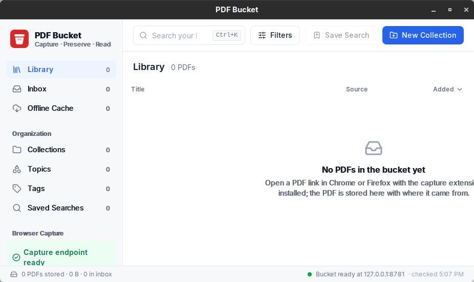
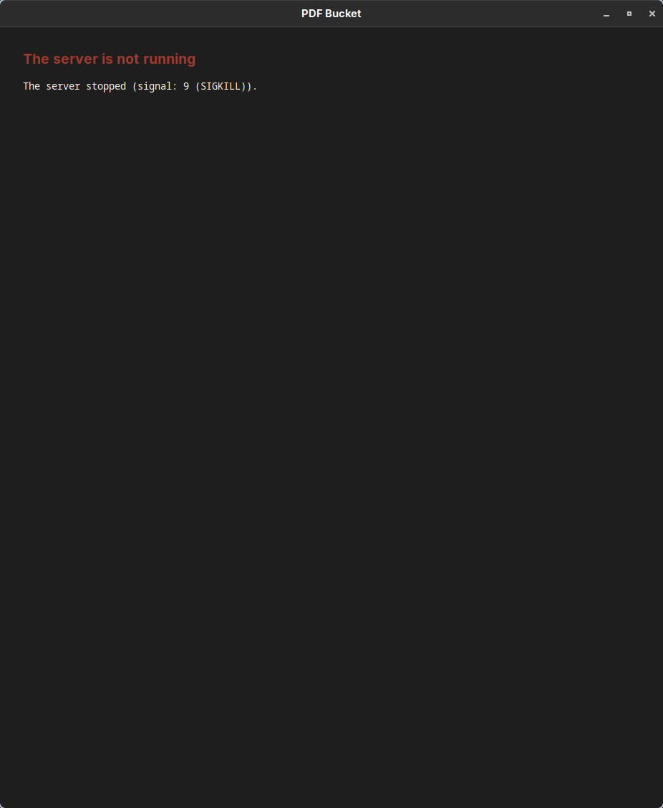
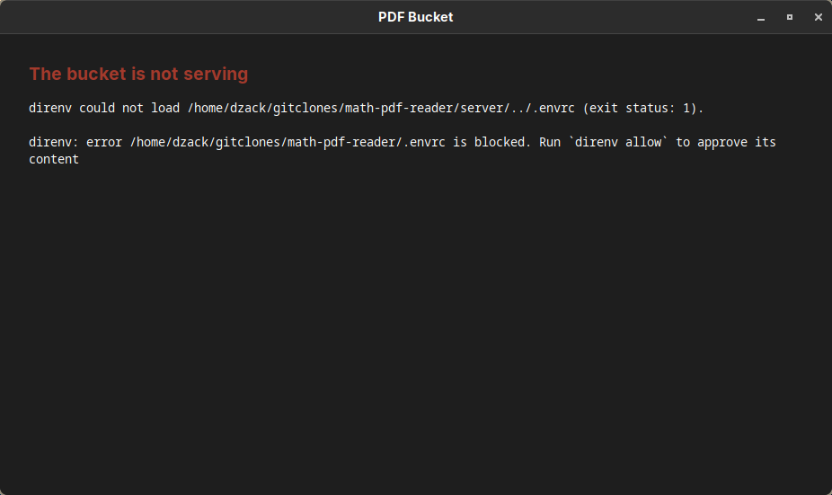

# M5 evidence: the app runs the bucket, and cache regeneration

Recorded on 2026-09-24 on the development workstation (Arch Linux, systemd user manager, Hyprland 0.56.2).

## The app runs the bucket

PDF Bucket runs while its desktop app runs, the way Zotero's connector server runs while Zotero does.
The release app (`desktop/src-tauri/src/server.rs`):

- **Start.** At startup it runs `bun run src/server/index.ts` in the checkout it was built from, with `NODE_ENV=production`, the PATH of its build, and the environment the checkout's `.envrc` sets (`direnv export json`, which carries the extraction providers' keys).
  The window shows the app's own page until `/status` answers (30 one-second attempts), then loads the bucket.

- **Stop.** Tray Quit and every orderly exit send the server SIGTERM and wait for it.
  The server also gets `PR_SET_PDEATHSIG`, so it receives SIGTERM when the app is killed or crashes.

- **Failure.** When the server stops on its own, cannot start, or never answers, the window shows the exit status and the server's last stderr lines, and comes forward.
  The app does not restart the server.

- **Index export.** The server rewrites `$XDG_DATA_HOME/pdf-bucket-export/index.json` after every capture and filing change (`IndexExporter`, `src/server/indexExport.ts`).

Under `just run` (`tauri dev`) the CLI's `beforeDevCommand` runs the server and the window loads it directly.

Recorded with a release build on a spare port (8781) and a scratch `XDG_DATA_HOME`; the tray menu was driven through its `com.canonical.dbusmenu` `Event` method, the call a click makes:

| Action | Result |
| --- | --- |
| start the app | `/status` answers after 2–4 s; `bun run src/server/index.ts` is a direct child of the app and holds the port; the index export exists (0 items) |
| tray Quit | app and server gone; nothing listens on the port |
| SIGTERM to the app | app and server gone; nothing listens on the port |
| SIGKILL to the app | app and server gone; nothing listens on the port |
| SIGKILL to the server | the window shows the report below; the app keeps running; tray Quit then exits cleanly |
| `.envrc` not allowed | the window shows direnv's message |
| second launch while running | exits 0; no second server |







## Install and login

`just provision` builds the web bundle, the pinned PDF.js viewer and the release app (`tauri build --no-bundle`), quits a running PDF Bucket, installs the app at `~/.local/bin/pdf-bucket-desktop` with its icon (`hicolor`, 32×32 and 128×128) and `pdf-bucket-desktop.desktop` as both the launcher entry (`$XDG_DATA_HOME/applications`) and the login autostart entry (`~/.config/autostart`), and starts it.
The entry and icon are named after the window's Wayland app_id, the binary name.

Desktop sessions that run XDG autostart start the app at login from the autostart entry.
This Hyprland session runs no XDG autostart: `~/.config/hypr/confs/startup.lua` starts `hyprland-session.target`. `systemd-xdg-autostart-generator(8)` turns the autostart entry into `app-pdf\x2dbucket\x2ddesktop@autostart.service`, and `just provision` installs a drop-in, `~/.config/systemd/user/hyprland-session.target.d/pdf-bucket.conf` (`desktop/autostart/hyprland-session.conf`), that makes the session target want that one unit.
home-manager's Hyprland module (`modules/services/window-managers/hyprland/default.nix`, `systemd.enableXdgAutostart`) instead adds `Wants=xdg-desktop-autostart.target` to the session target; on this machine that target would also start the fourteen other units the generator makes for this session (`XDG_CURRENT_DESKTOP=Hyprland`), among them nm-applet, dropbox and bitwarden, which `startup.lua` already starts, and picom, an X11 compositor.

## Tray and window

- **Tray icon.** A StatusNotifierItem with a two-item menu: Show PDF Bucket and Quit PDF Bucket.
  Linux tray icons report no clicks (tray-icon 0.24 through libayatana-appindicator), so any click opens the menu.

- **Close.** Closing the window hides it (`CloseRequested` → `prevent_close` + `hide`). The app and the server keep running.

- **Second launch.** `tauri-plugin-single-instance` holds `com.dzackgarza.pdfbucket.SingleInstance` on the session bus.
  A second launch exits before starting a server, and the running app shows its window.

- **Focus after show.** The follower script asks for focus when the page becomes visible, on its next animation frame.
  A focus request sent with the show arrives before the compositor maps the window, and Hyprland ignores it.

Recorded on 2026-09-24. Chromium had focus on the same workspace, and events were read from the Hyprland event socket.

| Action | Result |
| --- | --- |
| provisioning | tray item `tray_icon_tray_app_main` registered with `org.kde.StatusNotifierWatcher`; the icon appears in waybar's tray |
| close the window (`hl.dsp.window.close`) | no mapped window; app and tray item alive |
| capture while hidden 2 s, 30 s, 60 s (scratch data root) | window mapped again; with the rule in `desktop/hyprland/pdf-bucket.lua` loaded, `urgent>>`, `openwindow>>`, `activewindow>>pdf-bucket-desktop` |
| `gtk-launch pdf-bucket-desktop` while hidden | one process; `urgent>>` (before the map, ignored), `openwindow>>`, `urgent>>`, `activewindow>>pdf-bucket-desktop` |
| tray Show while hidden | `openwindow>>`, `urgent>>`, `activewindow>>pdf-bucket-desktop` |

## Extension builds

`just build` runs `bun run build` (web bundle, `wxt build`, `wxt zip -b firefox`) and then the Tauri bundle build (deb, rpm, AppImage; `NO_STRIP=true` because linuxdeploy's `strip` cannot read the `.relr.dyn` sections of Arch's libraries).
WXT's `outDir` is `dist`. After `just build` (exit 0), with the provisioned window running:

```console
$ find dist -maxdepth 2 -not -path 'dist/web/*' -not -path '*/assets' -not -path '*/chunks' -not -path '*/content-scripts' | sort
dist
dist/chrome-mv3
dist/chrome-mv3/background.js
dist/chrome-mv3/capture.html
dist/chrome-mv3/manifest.json
dist/firefox-mv2
dist/firefox-mv2/background.js
dist/firefox-mv2/capture.html
dist/firefox-mv2/manifest.json
dist/pdf-bucket-0.1.0-firefox.zip
dist/web
$ jq -c '{manifest_version, name, permissions, gecko: .browser_specific_settings.gecko.id}' dist/chrome-mv3/manifest.json dist/firefox-mv2/manifest.json
{"manifest_version":3,"name":"PDF Bucket","permissions":["declarativeNetRequestWithHostAccess","storage"],"gecko":null}
{"manifest_version":2,"name":"PDF Bucket","permissions":["webRequest","webRequestBlocking","storage","<all_urls>"],"gecko":"pdf-bucket@dzackgarza.com"}
```

The app runs the copy of the desktop binary that `just provision` installs at `~/.local/bin/pdf-bucket-desktop`, so `just build` and `just run` rewrite the build tree while it runs.
The extensions were not installed into the workstation's browsers by this milestone.

The README section **Browser extensions** gives the install steps: load-unpacked for Chrome and Chromium; for Firefox, a temporary add-on in any build, a permanent unsigned install in Developer Edition, Nightly or ESR with `xpinstall.signatures.required=false`, or an unlisted AMO signature (`web-ext sign --channel unlisted`) for release Firefox, which this workstation runs (Firefox 156.0).

## Index export and cache rebuild

`just export-index` writes `$XDG_DATA_HOME/pdf-bucket-export/index.json`: `version`, the collections and saved searches of `organization.json`, and one entry per stored PDF in key order with its embedded provenance (`pdf_url`, `source_url`, `captured_at`, `original_sha256`, `title_hint`), its title and authors, and its filing (tags, collections, notes, reading position, source checks, mirrors, `modifiedAt`). The export is outside the store root, so wiping or losing the store leaves it, and its fixed order makes two exports diff line by line under any backup or version control that holds the file.
It refuses to overwrite an export that lists an item whose PDF is missing (`PdfsMissingError`, naming the keys), since that export is the only record able to restore it.

`just import-index [file]` writes the export's filing into a data root that has no `organization.json`. `just rebuild-cache` downloads each listed PDF the root lacks from its `pdf_url`, then from each mirror in turn (`rebuild.concurrent_downloads` at once, `rebuild.download_timeout_seconds` each, from `pdf-bucket.config.json`), compares the bytes with `original_sha256`, and stores a match under the same key through `pdfbucket restore`, which embeds the recorded provenance and refuses any other bytes; a title and authors a resolver gave are recorded again.
It prints one outcome per item — `present`, `restored` (with the URL it came from), or `unrestored` with each URL tried and what it gave: `dead` (HTTP status or network error) or `changed` (the hash it serves; nothing stored) — and exits 1 unless every item is present or restored.
The library window does the same per item: an item the export holds whose PDF is gone is listed under Needs Re-fetch, with Rebuild beside it.

The running server writes the same export after every capture and filing change; `tests/index-export.test.ts` ("the running server rewrites the index export after a capture and after a filing change") captures a PDF and tags it through the server and reads each change back from the export.

### Evidence run

`just cache-evidence` (`tests/cache-evidence.ts`) runs the recipes on a temporary `XDG_DATA_HOME`; an in-process HTTP server stands in for the publishers and serves the committed fixture PDFs.
Tests: `tests/index-export.test.ts` (rebuild outcomes, round trip, refusals) and `tests/test_store.py` (`restore`).

```console
XDG_DATA_HOME=/tmp/pdf-bucket-m5-evidence-l42PxM
publisher http://127.0.0.1:40969

captured lecture-notes from http://127.0.0.1:40969/notes/lecture-notes.pdf
captured 2401.00001 from http://127.0.0.1:40969/pdf/2401.00001
captured ten-page-notes from http://127.0.0.1:40969/teaching/ten-page-notes.pdf
captured long-notes from http://127.0.0.1:40969/papers/long-notes.pdf
filed lecture-notes and 2401.00001 into Quadratic forms, with tags

## Export, wipe, import, rebuild, export again, diff

$ just export-index
exported 4 items to /tmp/pdf-bucket-m5-evidence-l42PxM/pdf-bucket-export/index.json
(exit 0)

$ trash /tmp/pdf-bucket-m5-evidence-l42PxM/pdf-bucket
(exit 0)

$ just import-index
imported the filing of 2 items into /tmp/pdf-bucket-m5-evidence-l42PxM/pdf-bucket
(exit 0)

$ diff <(jq -S . /tmp/pdf-bucket-m5-evidence-l42PxM/organization-before.json) <(jq -S . /tmp/pdf-bucket-m5-evidence-l42PxM/pdf-bucket/organization.json) && echo organization.json identical
organization.json identical
(exit 0)

$ just rebuild-cache
[
  {
    "key": "2401.00001",
    "status": "restored",
    "from": "http://127.0.0.1:40969/pdf/2401.00001",
    "stored_sha256": "b89ef1d26d679112084774f2d13d06edba9dbd1af05183175b10cfadb9202fd4"
  },
  {
    "key": "lecture-notes",
    "status": "restored",
    "from": "http://127.0.0.1:40969/notes/lecture-notes.pdf",
    "stored_sha256": "cb47ffa33b964bec4a437d2a0d57fc626b3581a09557940af62c5c621b234100"
  },
  {
    "key": "long-notes",
    "status": "restored",
    "from": "http://127.0.0.1:40969/papers/long-notes.pdf",
    "stored_sha256": "f23fe2decdff28d51a0e0c5bf8ced0351d5e8f14f7aae85685703ee966d4cbc0"
  },
  {
    "key": "ten-page-notes",
    "status": "restored",
    "from": "http://127.0.0.1:40969/teaching/ten-page-notes.pdf",
    "stored_sha256": "f20d7d1277bd2d69856e63795fe8b1ae3fb58eb7582a809d4faea10e3f56cef3"
  }
]
(exit 0)

$ just export-index
exported 4 items to /tmp/pdf-bucket-m5-evidence-l42PxM/pdf-bucket-export/index.json
(exit 0)

$ diff /tmp/pdf-bucket-m5-evidence-l42PxM/export-1.json /tmp/pdf-bucket-m5-evidence-l42PxM/pdf-bucket-export/index.json && echo exports identical
exports identical
(exit 0)

## Delete three PDFs, one of them now at a dead URL; rebuild

the publisher now answers 404 at http://127.0.0.1:40969/papers/long-notes.pdf
deleted lecture-notes.pdf
deleted 2401.00001.pdf
deleted long-notes.pdf

$ just rebuild-cache
[
  {
    "key": "2401.00001",
    "status": "restored",
    "from": "http://127.0.0.1:40969/pdf/2401.00001",
    "stored_sha256": "af1399fd2817bf6ca3641ab48a09281aab47a6d15c64e87f2bfa8c5434912b76"
  },
  {
    "key": "lecture-notes",
    "status": "restored",
    "from": "http://127.0.0.1:40969/notes/lecture-notes.pdf",
    "stored_sha256": "b8d4b9f2c3f09cb6d0d7780bec5b69ffba0a81860f444d570f1809004f1889f8"
  },
  {
    "key": "long-notes",
    "status": "unrestored",
    "attempts": [
      {
        "url": "http://127.0.0.1:40969/papers/long-notes.pdf",
        "status": "dead",
        "detail": "HTTP 404"
      }
    ]
  },
  {
    "key": "ten-page-notes",
    "status": "present"
  }
]
error: recipe `rebuild-cache` failed on line 49 with exit code 1
(exit 1)

$ ls /tmp/pdf-bucket-m5-evidence-l42PxM/pdf-bucket
2401.00001.pdf
lecture-notes.pdf
organization.json
ten-page-notes.pdf
(exit 0)

## Recorded original hash of each stored PDF against the fixture it came from

$ uv run --locked pdfbucket describe /tmp/pdf-bucket-m5-evidence-l42PxM/pdf-bucket lecture-notes | jq -r '"\(.key) \(.provenance.original_sha256)"'
lecture-notes 5e340929db3bf5002c7a87ad166fbb4e9673bf99e8a61f6f3a92f4904e043a25
(exit 0)

fixture lecture-notes.pdf 5e340929db3bf5002c7a87ad166fbb4e9673bf99e8a61f6f3a92f4904e043a25

$ uv run --locked pdfbucket describe /tmp/pdf-bucket-m5-evidence-l42PxM/pdf-bucket 2401.00001 | jq -r '"\(.key) \(.provenance.original_sha256)"'
2401.00001 429096666cf6b66a9bc55114aeef362934801178e19f1b45ba5c3de6072b960e
(exit 0)

fixture problem-set.pdf 429096666cf6b66a9bc55114aeef362934801178e19f1b45ba5c3de6072b960e

$ uv run --locked pdfbucket describe /tmp/pdf-bucket-m5-evidence-l42PxM/pdf-bucket ten-page-notes | jq -r '"\(.key) \(.provenance.original_sha256)"'
ten-page-notes 2cc26c66bfb63abe950e12cb71b40046d7e375858c50dd09fde4502d5d4d3b22
(exit 0)

fixture ten-page-notes.pdf 2cc26c66bfb63abe950e12cb71b40046d7e375858c50dd09fde4502d5d4d3b22

long-notes: no stored PDF
```
